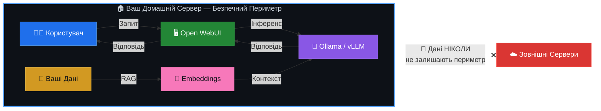
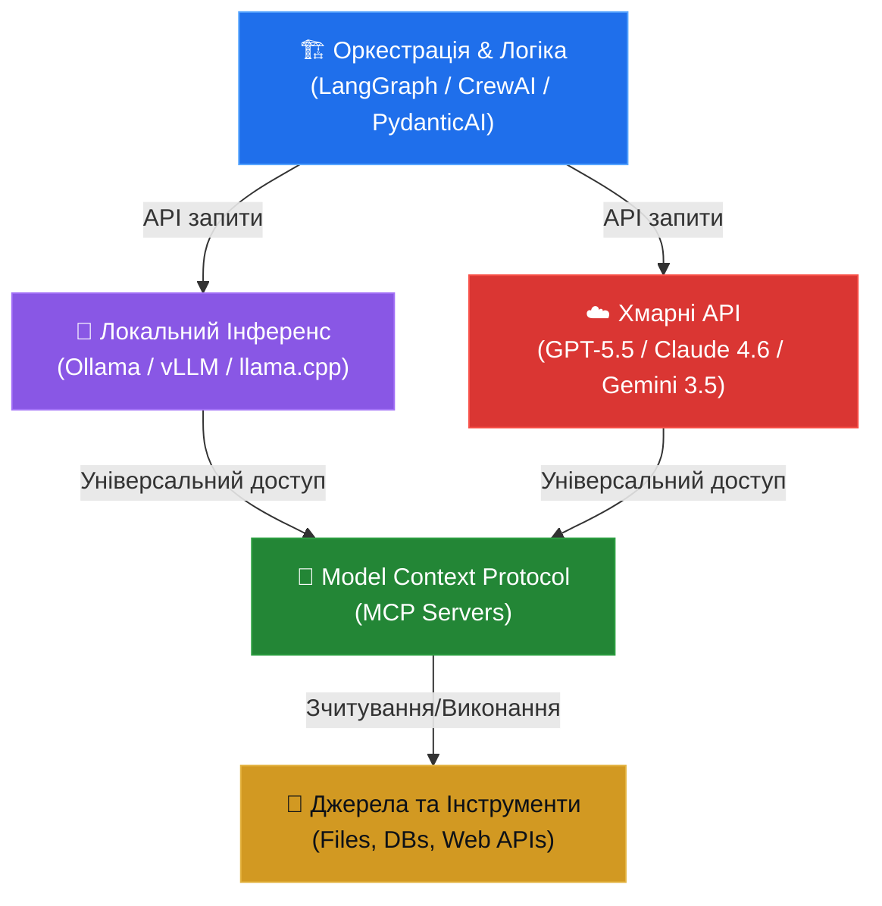

<p align="center">
  <strong>🇺🇦 Українська</strong> | <a href="./README_ENG.md">🇬🇧 English</a>
</p>

<p align="center">
  
  
  
  
</p>

<h1 align="center">🧠 AI-HomeLab</h1>
<h3 align="center">Домашні AI-Лабораторії в Україні 🇺🇦</h3>

<p align="center">
  <strong>Локальний ШІ · Мультиагентні Системи · Блекаут-Резилієнтність</strong>
</p>

---

Ласкаво просимо до центрального репозиторію ініціативи **AI-HomeLab**! Цей проєкт створено для того, щоб сформувати в Україні культуру відповідального, безпечного та практичного використання моделей штучного інтелекту та автономних агентів у домашніх умовах із обмеженим бюджетом.

> **Навіщо це потрібно?** Межа між звичайним користувачем ChatGPT та інженером, який вміє локально розгортати, квантувати та оркеструвати ШІ-агентів, визначає майбутнє технологічного ринку праці та цифрової безпеки України.

---

## 📜 МЕМОРАНДУМ ТА ФІЛОСОФІЯ ПРОЄКТУ

Кожен учасник спільноти AI-HomeLab та контриб'ютор цього репозиторію поділяє чотири фундаментальні принципи:

### 1. 🛡️ Технологічна Гігієна та Безпека

Ми **категорично не використовуємо, не тестуємо і не популяризуємо** програмне забезпечення, моделі штучного інтелекту чи інструменти, створені в РФ або геополітично ризикованих країнах (зокрема, КНР, такі як DeepSeek, Qwen тощо).

> [!CAUTION]
> **Заборонені моделі та інструменти:** DeepSeek, Qwen, YandexGPT, GigaChat, будь-які моделі з невідомим або непрозорим походженням датасетів.

**Наш стек — перевірений західний Open-Source:**

| Категорія | Інструменти |
|---|---|
| **LLM-моделі** | Meta LLaMA 4 (Scout/Maverick), Google Gemma 3/4, Mistral (Large 3 / Medium 3.5 / Small 4), Microsoft Phi-4 (Reasoning/Vision/Multimodal) |
| **Хмарні API** | OpenAI (GPT-5.5/5.4, GPT-5.4 mini/nano), Anthropic (Claude 4.x / 4.6 / 4.5), Google (Gemini 3.5/3.1) |
| **Інференс** | Ollama, vLLM, llama.cpp |
| **Оркестрація** | LangGraph, CrewAI, PydanticAI |

### 2. 🔒 Локальність та Суверенітет Даних

Чутливі українські дані (персональна інформація, внутрішні документи компаній, локальні реєстри) **не мають залишати периметр** нашої країни чи персонального комп'ютера.

Ми вчимося розгортати ШІ локально (через Ollama/vLLM), забезпечуючи повну автономність від сторонніх серверів:



### 3. ⚡ Економічність та Енергоефективність

Ми створюємо рішення, адаптовані до **українських реалій**. Це означає:

- **Максимум результату на споживчому залізі** — RTX 3060/4060/5060 або Apple Silicon
- **Використання безкоштовних/дешевих API** — Gemini 3.5 Flash / 3.1 Flash-Lite, GPT-5.4 mini для гібридних систем
- **Агресивна квантизація моделей** — Q4/Q8 через GGUF для економії VRAM
- **🔋 Блекаут-резилієнтність** — оптимізація споживання для стабільної роботи лабораторії від інверторів та зарядних станцій (EcoFlow, Bluetti) під час відключень електроенергії

> [!TIP]
> Типова домашня лабораторія споживає **80-150W** — менше за електрочайник. Одного повербанку на 2000Wh вистачить на **13-25 годин** безперервної роботи.

### 4. 🚀 Практичність та Кар'єрний Ліфт

Домашня лабораторія — це не просто хобі, це **найкращий рядок у вашому CV**. Ми фокусуємося не на написанні "промптів", а на розробці складної логіки:

- **Мультиагентні системи** — автономні команди ШІ-агентів, що вирішують складні задачі
- **RAG (Retrieval-Augmented Generation)** — пошук та генерація по вашим документам
- **Type-safe інтеграції** — надійний production-ready код із валідацією через Pydantic
- **Реальні пет-проєкти** — що конвертуються у офери та успішні продукти

### 5. 🔄 Архітектурна Взаємодія Компонентів

Сучасна домашня ШІ-лабораторія функціонує як трирівнева архітектура (Оркестрація ↔ Інференс ↔ Інструменти), інтегрована через відкриті та стандартизовані протоколи:



* **Шар оркестрації** керує логікою агентів, збереженням стану діалогів та суворою валідацією типів на рівні Python.
* **Шар інференсу** виконує моделі локально або звертається до хмари, використовуючи сумісні API (OpenAI/Anthropic Messages API).
* **Шар інструментів (MCP)** надає моделям стандартизований доступ до зовнішніх ресурсів без необхідності написання кастомних конекторів.

---

## ⚡ ШВИДКИЙ СТАРТ (Quick Start)

Розгорніть свою першу локальну ШІ-лабораторію за **3 кроки**:

### Крок 1: Встановити Ollama

```bash
curl -fsSL https://ollama.com/install.sh | sh
```

### Крок 2: Завантажити модель

```bash
# Легка модель для початку (~4GB, працює на 8GB RAM)
ollama pull gemma3:4b

# Або потужніша (потрібно 16GB RAM або GPU з 8GB+ VRAM)
ollama pull llama3.1:8b
```

### Крок 3: Запустити веб-інтерфейс

```bash
docker run -d \
  --name open-webui \
  -p 3000:8080 \
  --add-host=host.docker.internal:host-gateway \
  -v open-webui:/app/backend/data \
  -e OLLAMA_BASE_URL=http://host.docker.internal:11434 \
  --restart always \
  ghcr.io/open-webui/open-webui:main
```

Відкрийте `http://localhost:3000` — ваш локальний ChatGPT готовий! 🎉

> [!NOTE]
> Детальні інструкції для кожної платформи (Windows/macOS/Linux) дивіться у розділі [docs/setup/](./docs/setup/).

---

## 💻 МІНІМАЛЬНІ ВИМОГИ

| Компонент | Мінімум | Рекомендовано | Преміум |
|---|---|---|---|
| **CPU** | 4 ядра (Intel i5/Ryzen 5) | 8 ядер (Intel i7/Ryzen 7) | Apple M2 Pro+ |
| **RAM** | 8 GB | 16 GB | 32+ GB |
| **GPU** | — (CPU-only) | RTX 3060 12GB | RTX 4060 Ti 16GB / RTX 5060 |
| **Сховище** | 50 GB SSD | 256 GB NVMe | 1 TB NVMe |
| **ОС** | Ubuntu 22.04+ / macOS 13+ | Ubuntu 24.04 / macOS 14+ | Proxmox VE 8+ |
| **Енерго** | 220V розетка | UPS 600VA | EcoFlow + інвертор |

> [!IMPORTANT]
> **Apple Silicon (M1/M2/M3/M4)** — ідеальний вибір для українських реалій: висока продуктивність при мінімальному енергоспоживанні (15-30W під навантаженням). Працює від будь-якого повербанку через USB-C.

---

## 🛠️ СТРУКТУРА РЕПОЗИТОРІЮ

📂 [**`ai/`**](./)<br>
├── 📁 [**`benchmarks/`**](./benchmarks/) — *Бенчмарки заліза та енергоефективність*<br>
│&nbsp;&nbsp;&nbsp;└── ⚡ [**`hardware_efficiency.md`**](./benchmarks/hardware_efficiency.md) — *GPU vs Apple Silicon (t/s/W)*<br>
│<br>
├── 📁 [**`configs/`**](./configs/) — *Готові Docker-compose конфігурації*<br>
│&nbsp;&nbsp;&nbsp;├── ✅ [**`ollama/`**](./configs/ollama/) — *Ollama + Open WebUI в один клік*<br>
│&nbsp;&nbsp;&nbsp;├── ⏳ **`vllm/`** — `(coming soon)` *vLLM для production-grade інференсу*<br>
│&nbsp;&nbsp;&nbsp;└── ⏳ **`dify/`** — `(coming soon)` *Dify AI — no-code агентна платформа*<br>
│<br>
├── 📁 [**`templates/`**](./templates/) — *Шаблони та приклади коду*<br>
│&nbsp;&nbsp;&nbsp;├── 🧠 [**`langgraph_rag_agent.py`**](./templates/langgraph_rag_agent.py) — *Corrective RAG Agent (LangGraph + Qdrant)*<br>
│&nbsp;&nbsp;&nbsp;└── 🤖 [**`agent-code-cli/`**](./templates/agent-code-cli/) — *Claude Code Style Agent CLI (Ollama + Claude)*<br>
│<br>
├── 📁 **`projects/`** — `(coming soon)` *Ідеї та реалізації пет-проєктів*<br>
│&nbsp;&nbsp;&nbsp;├── ⏳ **`local-osint/`** — `(coming soon)` *Локальні OSINT-помічники*<br>
│&nbsp;&nbsp;&nbsp;├── ⏳ **`biz-automation/`** — `(coming soon)` *Автоматизатори бізнес-рутини*<br>
│&nbsp;&nbsp;&nbsp;└── ⏳ **`rag-pipeline/`** — `(coming soon)` *RAG-пайплайн по власним документам*<br>
│<br>
├── 📁 [**`docs/`**](./docs/) — *Документація та гайди*<br>
│&nbsp;&nbsp;&nbsp;├── 📁 [**`research/`**](./docs/research/) — *Дослідження AI-ландшафту*<br>
│&nbsp;&nbsp;&nbsp;│&nbsp;&nbsp;&nbsp;├── 🔬 [**`ai-landscape-june-2026.md`**](./docs/research/ai-landscape-june-2026.md) — *Звіт по ШІ-моделях та стеку*<br>
│&nbsp;&nbsp;&nbsp;│&nbsp;&nbsp;&nbsp;└── 🚀 [**`free-ai-tools-lifehacks.md`**](./docs/research/free-ai-tools-lifehacks.md) — *Безкоштовні ШІ-інструменти та лайфхаки*<br>
│&nbsp;&nbsp;&nbsp;├── 📁 [**`setup/`**](./docs/setup/) — *Крок-за-кроком для кожної ОС*<br>
│&nbsp;&nbsp;&nbsp;│&nbsp;&nbsp;&nbsp;├── ⏱️ [**`first-model-15-min.md`**](./docs/setup/first-model-15-min.md) — *Швидкий запуск першої моделі*<br>
│&nbsp;&nbsp;&nbsp;│&nbsp;&nbsp;&nbsp;└── 🔋 [**`blackout-guide.md`**](./docs/setup/blackout-guide.md) — *Гайд з енергоефективності під час блекаутів*<br>
│&nbsp;&nbsp;&nbsp;├── 📁 [**`security/`**](./docs/security/) — *Політики, аудити та ізоляція моделей*<br>
│&nbsp;&nbsp;&nbsp;│&nbsp;&nbsp;&nbsp;├── 🛡️ [**`model_isolation.md`**](./docs/security/model_isolation.md) — *Ізоляція виконання та TEE*<br>
│&nbsp;&nbsp;&nbsp;│&nbsp;&nbsp;&nbsp;├── 🛡️ [**`advanced_hardening.md`**](./docs/security/advanced_hardening.md) — *Глибока ізоляція (VLAN, nftables, Gitleaks)*<br>
│&nbsp;&nbsp;&nbsp;│&nbsp;&nbsp;&nbsp;└── ⏳ **`model-vetting.md`** — `(coming soon)` *Критерії перевірки моделей*<br>
│&nbsp;&nbsp;&nbsp;└── ⏳ **`quantization/`** — `(coming soon)` *Гайд по квантизації (Q4/Q8/GGUF)*<br>
│<br>
├── 📄 [**`README.md`**](./README.md) — *Цей файл (UA)*<br>
├── 📄 [**`README_ENG.md`**](./README_ENG.md) — *English version*<br>
├── 📄 [**`CONTRIBUTING.md`**](./CONTRIBUTING.md) — *Гайд для контриб'юторів*<br>
├── 📄 [**`SECURITY.md`**](./SECURITY.md) — *Політики безпеки*<br>
├── 📄 [**`LICENSE`**](./LICENSE) — *MIT ліцензія*<br>
└── 📄 [**`ROADMAP.md`**](./ROADMAP.md) — *Дорожня карта проєкту*<br>
<br>
---

## 📚 МОДУЛІ ТА НАВІГАЦІЯ

| Модуль | Опис | Статус |
|---|---|---|
| ⏱️ [**15-Min Setup**](./docs/setup/first-model-15-min.md) | Швидкий покроковий гайд: встановлення Ollama, запуск Open WebUI через Docker, вибір та чат з першою моделлю | ✅ Готово |
| 🔋 [**Blackout Guide**](./docs/setup/blackout-guide.md) | Практичний гайд з мінімізації споживання енергії (Nvidia Power Limit, обмеження потоків CPU, вибір заліза) під час відключень світла | ✅ Готово |
| 🧠 [**CRAG Agent**](./templates/langgraph_rag_agent.py) | Corrective RAG агент на LangGraph + Qdrant. Циклічний граф: пошук → оцінка → переформулювання → генерація | ✅ Готово |
| 🤖 [**Agent CLI**](./templates/agent-code-cli/) | Claude Code style консольний ШІ-агент у Harness оболонці (безпечний CWD, права на запуск bash, diff-попередній перегляд латок) | ✅ Готово |
| 🛡️ [**Advanced Hardening**](./docs/security/advanced_hardening.md) | VLAN-ізоляція від IoT, nftables фаєрвол, Docker безпека, Gitleaks + pre-commit | ✅ Готово |
| 🛡️ [**Model Isolation**](./docs/security/model_isolation.md) | Гайд по ізоляції моделей та пісочницях (gVisor, Firecracker, WASM, TEE, Zero-Trust network) | ✅ Готово |
| ⚡ [**Hardware Benchmarks**](./benchmarks/hardware_efficiency.md) | GPU vs Apple Silicon (t/s/W), Cold Start аналіз, VRAM contention, рекомендації по тієрах | ✅ Готово |
| 🐳 [**Ollama + Open WebUI**](./configs/ollama/) | Docker Compose: CPU/GPU профілі, безпечна конфігурація, `.env.example` | ✅ Готово |
| 🔬 [**AI Landscape 2026**](./docs/research/ai-landscape-june-2026.md) | Дослідження: моделі, API, фреймворки, RAG, MCP, залізо, бюджети, а також аналіз автономних локальних агентів (пам'ять, stealth-браузери, голосові/відео асистенти) | ✅ Готово |
| 🚀 [**Free AI Tools & Hacks**](./docs/research/free-ai-tools-lifehacks.md) | Стек найкращих безкоштовних інструментів та 7 практичних лайфхаків для підвищення якості відповідей | ✅ Готово |
| 🗺️ [**Roadmap**](./ROADMAP.md) | Дорожня карта проєкту: Фаза 1 (Фундамент), Фаза 2 (Практика), Фаза 3 (Спільнота) | ✅ Готово |
| 🔐 [**Security Policy**](./SECURITY.md) | Модельна гігієна, ізоляція даних, облікові дані | ✅ Готово |
| 🤝 [**Contributing**](./CONTRIBUTING.md) | Гайд для контриб'юторів: Issues → Branch → PR → Merge | ✅ Готово |

---

## 🗺️ ДОРОЖНЯ КАРТА (ROADMAP)

### 🏁 Фаза 1 — Фундамент (Q3 2026)
- [x] Меморандум та філософія проєкту
- [x] Docker-compose для Ollama + Open WebUI
- [x] Бенчмарки RTX 3060/4060/5060 з квантизованими моделями
- [x] Гайд: "Перша модель за 15 хвилин"
- [x] Шаблон RAG-пайплайну на LangGraph (CRAG Agent)
- [x] Глибока ізоляція домашньої лаби (Advanced Hardening)
- [x] Бенчмарки енергоефективності (t/s/W)
- [x] Консольний ШІ-агент для кодування (Claude Code style CLI)

### 🚀 Фаза 2 — Практика (Q4 2026)
- [ ] Мультиагентний шаблон на CrewAI для бізнес-автоматизації
- [x] Блекаут-гайд: налаштування лаби для роботи від EcoFlow
- [ ] Локальний OSINT-помічник (пет-проєкт)
- [ ] Шаблон stealth-автоматизації та веб-workflow (за досвідом CloakBrowser)
- [ ] Інтеграція сесійної пам'яті (AgentMemory) у шаблони агента
- [ ] Вебінар/стрім: "AI-HomeLab Live Setup"

### 🌟 Фаза 3 — Спільнота (Q1 2027)
- [ ] Telegram-бот для автоматизації бенчмарків
- [ ] CI/CD пайплайн для тестування моделей
- [ ] Партнерства з українськими AI-спільнотами
- [ ] Щомісячний дайджест нових моделей та інструментів

---

## 🔐 БЕЗПЕКА

Ми серйозно ставимося до безпеки. Перед використанням будь-якої моделі у вашій лабораторії:

1. **Перевірте походження** — модель повинна мати прозору ліцензію та відоме джерело датасетів
2. **Ізолюйте середовище** — запускайте моделі у Docker-контейнерах або віртуальних машинах
3. **Не передавайте чутливі дані** — у хмарні API відправляйте тільки знеособлені дані
4. **Оновлюйте регулярно** — слідкуйте за CVE та оновленнями безпеки інструментів

> Детальніше: [`SECURITY.md`](./SECURITY.md)

---

## 🤝 ПРИЄДНУЙТЕСЬ ДО СПІЛЬНОТИ

### 💬 Канали зв'язку

| Платформа | Посилання | Призначення |
|---|---|---|
| **Telegram** | *Скоро* | Обговорення заліза, архітектури, купівля/продаж GPU |
| **GitHub Discussions** | [Discussions](https://github.com/weby-homelab/ai/discussions) | Питання, ідеї, RFC |
| **Issues** | [Issues](https://github.com/weby-homelab/ai/issues) | Баг-репорти та feature requests |

### 🤲 Як контриб'ютити

Знайшли круту модель, оптимізували конфіг під EcoFlow або написали корисного локального агента?

1. **Fork** цього репозиторію
2. Створіть **Issue** з описом вашої ідеї
3. Створіть гілку `feature/ваша-фіча`
4. Зробіть **Pull Request** з детальним описом

> Детальніше: [`CONTRIBUTING.md`](./CONTRIBUTING.md)

---

## 📄 Ліцензія

Цей проєкт ліцензовано під [MIT License](./LICENSE).

---

<p align="center">
  <strong>🇺🇦 Давайте будувати AI-майбутнє України разом!</strong>
</p>

<p align="center">
  <sub>Створено з ❤️ для української tech-спільноти</sub>
</p>
