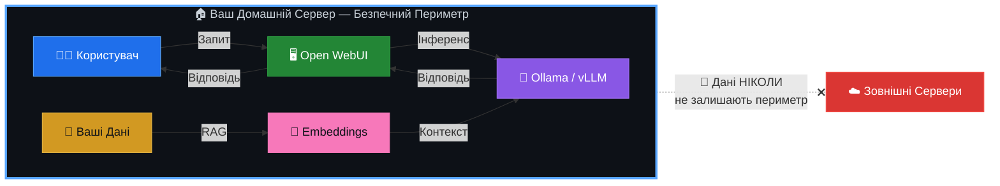

<p align="center">
  
  
  
  
</p>

<h1 align="center">🧠 AI-HomeLab</h1>
<h3 align="center">Домашні AI-Лабораторії в Україні 🇺🇦</h3>

<p align="center">
  <strong>Локальний ШІ · Мультиагентні Системи · Блекаут-Резилієнтність</strong>
</p>

---

Ласкаво просимо до центрального репозиторію ініціативи **AI-HomeLab**! Цей проєкт створено для того, щоб сформувати в Україні культуру відповідального, безпечного та практичного використання моделей штучного інтелекту та автономних агентів у домашніх умовах із обмеженим бюджетом.

> **Навіщо це потрібно?** Межа між звичайним користувачем ChatGPT та інженером, який вміє локально розгортати, квантувати та оркеструвати ШІ-агентів, визначає майбутнє технологічного ринку праці та цифрової безпеки України.

---

## 📜 МЕМОРАНДУМ ТА ФІЛОСОФІЯ ПРОЄКТУ

Кожен учасник спільноти AI-HomeLab та контриб'ютор цього репозиторію поділяє чотири фундаментальні принципи:

### 1. 🛡️ Технологічна Гігієна та Безпека

Ми **категорично не використовуємо, не тестуємо і не популяризуємо** програмне забезпечення, моделі штучного інтелекту чи інструменти, створені в РФ або геополітично ризикованих країнах (зокрема, КНР, такі як DeepSeek, Qwen тощо).

> [!CAUTION]
> **Заборонені моделі та інструменти:** DeepSeek, Qwen, YandexGPT, GigaChat, будь-які моделі з невідомим або непрозорим походженням датасетів.

**Наш стек — перевірений західний Open-Source:**

| Категорія | Інструменти |
|---|---|
| **LLM-моделі** | Meta LLaMA 4, Google Gemma 3, Mistral, Microsoft Phi-4 |
| **Хмарні API** | OpenAI (GPT-4o), Anthropic (Claude), Google (Gemini) |
| **Інференс** | Ollama, vLLM, llama.cpp |
| **Оркестрація** | LangGraph, CrewAI, PydanticAI |

### 2. 🔒 Локальність та Суверенітет Даних

Чутливі українські дані (персональна інформація, внутрішні документи компаній, локальні реєстри) **не мають залишати периметр** нашої країни чи персонального комп'ютера.

Ми вчимося розгортати ШІ локально (через Ollama/vLLM), забезпечуючи повну автономність від сторонніх серверів:



### 3. ⚡ Економічність та Енергоефективність

Ми створюємо рішення, адаптовані до **українських реалій**. Це означає:

- **Максимум результату на споживчому залізі** — RTX 3060/4060/5060 або Apple Silicon
- **Використання безкоштовних/дешевих API** — Gemini Flash, GPT-4o mini для гібридних систем
- **Агресивна квантизація моделей** — Q4/Q8 через GGUF для економії VRAM
- **🔋 Блекаут-резилієнтність** — оптимізація споживання для стабільної роботи лабораторії від інверторів та зарядних станцій (EcoFlow, Bluetti) під час відключень електроенергії

> [!TIP]
> Типова домашня лабораторія споживає **80-150W** — менше за електрочайник. Одного повербанку на 2000Wh вистачить на **13-25 годин** безперервної роботи.

### 4. 🚀 Практичність та Кар'єрний Ліфт

Домашня лабораторія — це не просто хобі, це **найкращий рядок у вашому CV**. Ми фокусуємося не на написанні "промптів", а на розробці складної логіки:

- **Мультиагентні системи** — автономні команди ШІ-агентів, що вирішують складні задачі
- **RAG (Retrieval-Augmented Generation)** — пошук та генерація по вашим документам
- **Type-safe інтеграції** — надійний production-ready код із валідацією через Pydantic
- **Реальні пет-проєкти** — що конвертуються у офери та успішні продукти

---

## ⚡ ШВИДКИЙ СТАРТ (Quick Start)

Розгорніть свою першу локальну ШІ-лабораторію за **3 кроки**:

### Крок 1: Встановити Ollama

```bash
curl -fsSL https://ollama.com/install.sh | sh
```

### Крок 2: Завантажити модель

```bash
# Легка модель для початку (~4GB, працює на 8GB RAM)
ollama pull gemma3:4b

# Або потужніша (потрібно 16GB RAM або GPU з 8GB+ VRAM)
ollama pull llama3.3:8b
```

### Крок 3: Запустити веб-інтерфейс

```bash
docker run -d \
  --name open-webui \
  -p 3000:8080 \
  --add-host=host.docker.internal:host-gateway \
  -v open-webui:/app/backend/data \
  -e OLLAMA_BASE_URL=http://host.docker.internal:11434 \
  --restart always \
  ghcr.io/open-webui/open-webui:main
```

Відкрийте `http://localhost:3000` — ваш локальний ChatGPT готовий! 🎉

> [!NOTE]
> Детальні інструкції для кожної платформи (Windows/macOS/Linux) дивіться у [`/docs/setup`](./docs/setup/).

---

## 💻 МІНІМАЛЬНІ ВИМОГИ

| Компонент | Мінімум | Рекомендовано | Преміум |
|---|---|---|---|
| **CPU** | 4 ядра (Intel i5/Ryzen 5) | 8 ядер (Intel i7/Ryzen 7) | Apple M2 Pro+ |
| **RAM** | 8 GB | 16 GB | 32+ GB |
| **GPU** | — (CPU-only) | RTX 3060 12GB | RTX 4060 Ti 16GB / RTX 5060 |
| **Сховище** | 50 GB SSD | 256 GB NVMe | 1 TB NVMe |
| **ОС** | Ubuntu 22.04+ / macOS 13+ | Ubuntu 24.04 / macOS 14+ | Proxmox VE 8+ |
| **Енерго** | 220V розетка | UPS 600VA | EcoFlow + інвертор |

> [!IMPORTANT]
> **Apple Silicon (M1/M2/M3/M4)** — ідеальний вибір для українських реалій: висока продуктивність при мінімальному енергоспоживанні (15-30W під навантаженням). Працює від будь-якого повербанку через USB-C.

---

## 🛠️ СТРУКТУРА РЕПОЗИТОРІЮ

```
ai/
├── 📁 benchmarks/         # Бенчмарки заліза та енергоефективність
│   └── hardware_efficiency.md  # ⚡ GPU vs Apple Silicon (t/s/W)
│
├── 📁 configs/            # Готові Docker-compose конфігурації
│   ├── ollama/            # ✅ Ollama + Open WebUI в один клік
│   ├── vllm/              # vLLM для production-grade інференсу
│   └── dify/              # Dify AI — no-code агентна платформа
│
├── 📁 templates/          # Шаблони та приклади коду
│   └── langgraph_rag_agent.py  # 🧠 Corrective RAG Agent (LangGraph + Qdrant)
│
├── 📁 projects/           # Ідеї та реалізації пет-проєктів
│   ├── local-osint/       # Локальні OSINT-помічники
│   ├── biz-automation/    # Автоматизатори бізнес-рутини
│   └── rag-pipeline/      # RAG-пайплайн по власним документам
│
├── 📁 docs/               # Документація та гайди
│   ├── research/          # 🔬 Дослідження AI-ландшафту
│   ├── setup/             # Крок-за-кроком для кожної ОС
│   ├── security/          # Best practices з ізоляції моделей
│   └── quantization/      # Гайд по квантизації (Q4/Q8/GGUF)
│
├── 📁 security/           # Політики безпеки та аудити
│   ├── advanced_hardening.md  # 🛡️ Глибока ізоляція (VLAN, nftables, Gitleaks)
│   └── model-vetting.md   # Критерії перевірки моделей
│
├── 📄 README.md           # Цей файл
├── 📄 CONTRIBUTING.md     # Гайд для контриб'юторів
├── 📄 SECURITY.md         # Політика безпеки
├── 📄 LICENSE             # MIT License
└── 📄 ROADMAP.md          # Дорожня карта проєкту
```

---

## 📚 МОДУЛІ ТА НАВІГАЦІЯ

| Модуль | Опис | Статус |
|---|---|---|
| 🧠 [**CRAG Agent**](./templates/langgraph_rag_agent.py) | Corrective RAG агент на LangGraph + Qdrant. Циклічний граф: пошук → оцінка → переформулювання → генерація | ✅ Готово |
| 🛡️ [**Advanced Hardening**](./security/advanced_hardening.md) | VLAN-ізоляція від IoT, nftables фаєрвол, Docker безпека, Gitleaks + pre-commit | ✅ Готово |
| ⚡ [**Hardware Benchmarks**](./benchmarks/hardware_efficiency.md) | GPU vs Apple Silicon (t/s/W), Cold Start аналіз, VRAM contention, рекомендації по тієрах | ✅ Готово |
| 🐳 [**Ollama + Open WebUI**](./configs/ollama/) | Docker Compose: CPU/GPU профілі, безпечна конфігурація, `.env.example` | ✅ Готово |
| 🔬 [**AI Landscape 2026**](./docs/research/ai-landscape-may-2026.md) | Дослідження: моделі, API, фреймворки, RAG, MCP, залізо, бюджети | ✅ Готово |
| 🔐 [**Security Policy**](./SECURITY.md) | Модельна гігієна, ізоляція даних, облікові дані | ✅ Готово |
| 🤝 [**Contributing**](./CONTRIBUTING.md) | Гайд для контриб'юторів: Issues → Branch → PR → Merge | ✅ Готово |

---

## 🗺️ ДОРОЖНЯ КАРТА (ROADMAP)

### 🏁 Фаза 1 — Фундамент (Q3 2026)
- [x] Меморандум та філософія проєкту
- [x] Docker-compose для Ollama + Open WebUI
- [x] Бенчмарки RTX 3060/4060/5060 з квантизованими моделями
- [ ] Гайд: "Перша модель за 15 хвилин"
- [x] Шаблон RAG-пайплайну на LangGraph (CRAG Agent)
- [x] Глибока ізоляція домашньої лаби (Advanced Hardening)
- [x] Бенчмарки енергоефективності (t/s/W)

### 🚀 Фаза 2 — Практика (Q4 2026)
- [ ] Мультиагентний шаблон на CrewAI для бізнес-автоматизації
- [ ] Блекаут-гайд: налаштування лаби для роботи від EcoFlow
- [ ] Локальний OSINT-помічник (пет-проєкт)
- [ ] Вебінар/стрім: "AI-HomeLab Live Setup"

### 🌟 Фаза 3 — Спільнота (Q1 2027)
- [ ] Telegram-бот для автоматизації бенчмарків
- [ ] CI/CD пайплайн для тестування моделей
- [ ] Партнерства з українськими AI-спільнотами
- [ ] Щомісячний дайджест нових моделей та інструментів

---

## 🔐 БЕЗПЕКА

Ми серйозно ставимося до безпеки. Перед використанням будь-якої моделі у вашій лабораторії:

1. **Перевірте походження** — модель повинна мати прозору ліцензію та відоме джерело датасетів
2. **Ізолюйте середовище** — запускайте моделі у Docker-контейнерах або віртуальних машинах
3. **Не передавайте чутливі дані** — у хмарні API відправляйте тільки знеособлені дані
4. **Оновлюйте регулярно** — слідкуйте за CVE та оновленнями безпеки інструментів

> Детальніше: [`SECURITY.md`](./SECURITY.md)

---

## 🤝 ПРИЄДНУЙТЕСЬ ДО СПІЛЬНОТИ

### 💬 Канали зв'язку

| Платформа | Посилання | Призначення |
|---|---|---|
| **Telegram** | *Скоро* | Обговорення заліза, архітектури, купівля/продаж GPU |
| **GitHub Discussions** | [Discussions](https://github.com/weby-homelab/ai/discussions) | Питання, ідеї, RFC |
| **Issues** | [Issues](https://github.com/weby-homelab/ai/issues) | Баг-репорти та feature requests |

### 🤲 Як контриб'ютити

Знайшли круту модель, оптимізували конфіг під EcoFlow або написали корисного локального агента?

1. **Fork** цього репозиторію
2. Створіть **Issue** з описом вашої ідеї
3. Створіть гілку `feature/ваша-фіча`
4. Зробіть **Pull Request** з детальним описом

> Детальніше: [`CONTRIBUTING.md`](./CONTRIBUTING.md)

---

## 📄 Ліцензія

Цей проєкт ліцензовано під [MIT License](./LICENSE).

---

<p align="center">
  <strong>🇺🇦 Давайте будувати AI-майбутнє України разом!</strong>
</p>

<p align="center">
  <sub>Створено з ❤️ для української tech-спільноти</sub>
</p>
