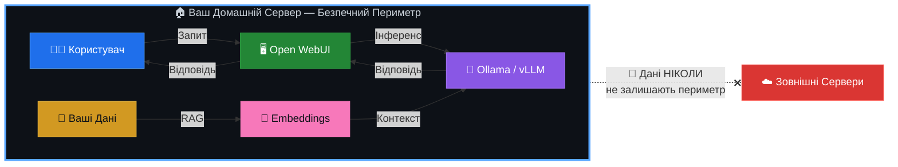
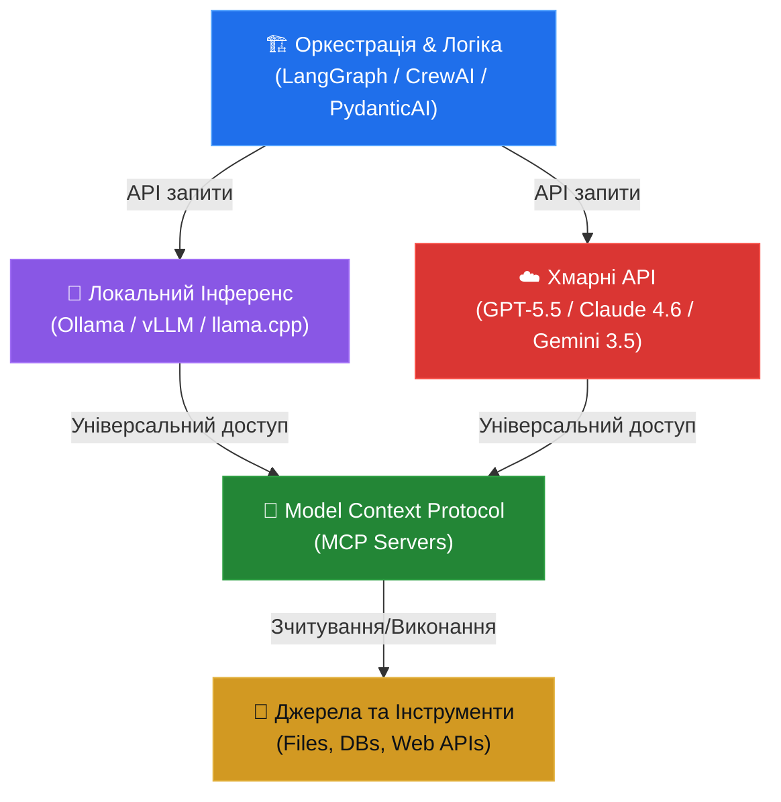

<p align="center">
  <strong>🇺🇦 Українська</strong> | <a href="./README_ENG.md">🇬🇧 English</a>
</p>

<p align="center">
  
  
  
  
</p>

<h1 align="center">🧠 AI-HomeLab</h1>
<h3 align="center">Домашні AI-Лабораторії в Україні 🇺🇦</h3>

<p align="center">
  <strong>Локальний ШІ · Мультиагентні Системи · Блекаут-Резилієнтність</strong>
</p>

---

Ласкаво просимо до центрального репозиторію ініціативи **AI-HomeLab**! Цей проєкт створено для того, щоб сформувати в Україні культуру відповідального, безпечного та практичного використання моделей штучного інтелекту та автономних агентів у домашніх умовах із обмеженим бюджетом.

> **Навіщо це потрібно?** Межа між звичайним користувачем ChatGPT та інженером, який вміє локально розгортати, квантувати та оркеструвати ШІ-агентів, визначає майбутнє технологічного ринку праці та цифрової безпеки України.

---

## 📌 ЗМІСТ (TABLE OF CONTENTS)

* [📜 Меморандум та Філософія Проєкту](#-меморандум-та-філософія-проєкту)
* [⚡ Швидкий Старт (Quick Start)](#-швидкий-старт-quick-start)
* [💻 Мінімальні Вимоги](#-мінімальні-вимоги)
* [🛠️ Структура Репозиторію](#️-структура-репозиторію)
* [📚 Модулі та Навігація](#-модулі-та-навігація)
* [🗺️ Дорожня Карта (Roadmap)](#️-дорожня-карта-roadmap)
* [🔐 Безпека](#-безпека)
* [🤝 Приєднуйтесь до Спільноти](#-приєднуйтесь-до-спільноти)
* [📄 Ліцензія](#-ліцензія)

---

## 📜 МЕМОРАНДУМ ТА ФІЛОСОФІЯ ПРОЄКТУ

Кожен учасник спільноти AI-HomeLab та контриб'ютор цього репозиторію поділяє чотири фундаментальні принципи:

### 1. 🛡️ Технологічна Гігієна та Безпека

Ми **категорично не використовуємо, не тестуємо і не популяризуємо** програмне забезпечення, моделі штучного інтелекту чи інструменти, створені в РФ або геополітично ризикованих країнах (зокрема, КНР, такі як DeepSeek, Qwen тощо).

> [!CAUTION]
> **Заборонені моделі та інструменти:** DeepSeek, Qwen, YandexGPT, GigaChat, будь-які моделі з невідомим або непрозорим походженням датасетів.

**Наш стек — перевірений західний Open-Source:**

| Категорія | Інструменти |
|---|---|
| **LLM-моделі** | Meta LLaMA 4 (Scout/Maverick), Google Gemma 3/4, Mistral (Large 3 / Medium 3.5 / Small 4), Microsoft Phi-4 (Reasoning/Vision/Multimodal) |
| **Хмарні API** | OpenAI (GPT-5.5/5.4, GPT-5.4 mini/nano), Anthropic (Claude 4.x / 4.6 / 4.5), Google (Gemini 3.5/3.1) |
| **Інференс** | Ollama, vLLM, llama.cpp |
| **Оркестрація** | LangGraph, CrewAI, PydanticAI |

### 2. 🔒 Локальність та Суверенітет Даних

Чутливі українські дані (персональна інформація, внутрішні документи компаній, локальні реєстри) **не мають залишати периметр** нашої країни чи персонального комп'ютера.

Ми вчимося розгортати ШІ локально (через Ollama/vLLM), забезпечуючи повну автономність від сторонніх серверів:



### 3. ⚡ Економічність та Енергоефективність

Ми створюємо рішення, адаптовані до **українських реалій**. Це означає:

- **Максимум результату на споживчому залізі** — RTX 3060/4060/5060 або Apple Silicon
- **Використання безкоштовних/дешевих API** — Gemini 3.5 Flash / 3.1 Flash-Lite, GPT-5.4 mini для гібридних систем
- **Агресивна квантизація моделей** — Q4/Q8 через GGUF для економії VRAM
- **🔋 Блекаут-резилієнтність** — оптимізація споживання для стабільної роботи лабораторії від інверторів та зарядних станцій (EcoFlow, Bluetti) під час відключень електроенергії

> [!TIP]
> Типова домашня лабораторія споживає **80-150W** — менше за електрочайник. Одного повербанку на 2000Wh вистачить на **13-25 годин** безперервної роботи.

### 4. 🚀 Практичність та Кар'єрний Ліфт

Домашня лабораторія — це не просто хобі, це **найкращий рядок у вашому CV**. Ми фокусуємося не на написанні "промптів", а на розробці складної логіки:

- **Мультиагентні системи** — автономні команди ШІ-агентів, що вирішують складні задачі
- **RAG (Retrieval-Augmented Generation)** — пошук та генерація по вашим документам
- **Type-safe інтеграції** — надійний production-ready код із валідацією через Pydantic
- **Реальні пет-проєкти** — що конвертуються у офери та успішні продукти

### 5. 🔄 Архітектурна Взаємодія Компонентів

Сучасна домашня ШІ-лабораторія функціонує як трирівнева архітектура (Оркестрація ↔ Інференс ↔ Інструменти), інтегрована через відкриті та стандартизовані протоколи:



* **Шар оркестрації** керує логікою агентів, збереженням стану діалогів та суворою валідацією типів на рівні Python.
* **Шар інференсу** виконує моделі локально або звертається до хмари, використовуючи сумісні API (OpenAI/Anthropic Messages API).
* **Шар інструментів (MCP)** надає моделям стандартизований доступ до зовнішніх ресурсів без необхідності написання кастомних конекторів.

---

## ⚡ ШВИДКИЙ СТАРТ (Quick Start)

Станом на **червень 2026 року (06.2026)**, ви можете розгорнути локальну ШІ-лабораторію за двома основними сценаріями:

### Опція А: Стандартний стек (Ollama + Open WebUI) — Рекомендовано для початківців

Найпростіший шлях для ноутбуків та домашніх серверів.

1. **Встановіть Ollama:**
   ```bash
   curl -fsSL https://ollama.com/install.sh | sh
   ```
2. **Завантажте сучасну модель сімейства Gemma 4 (випущено у 04.2026 / 06.2026):**
   ```bash
   # Надшвидка мультимодальна edge-модель для слабких ПК (до 8GB RAM):
   ollama pull gemma4:e4b
   
   # Нова флагманська 12B модель (червень 2026) з нативним аудіо без енкодерів (потрібно 16GB RAM):
   ollama pull gemma4:12b
   
   # Золотий стандарт для коду та RAG (потрібно 16GB RAM / GPU 8GB+ VRAM):
   ollama pull llama3.1:8b
   ```
3. **Запустіть Open WebUI в один клік через Docker:**
   ```bash
   docker run -d \
     --name open-webui \
     -p 3000:8080 \
     --add-host=host.docker.internal:host-gateway \
     -v open-webui:/app/backend/data \
     -e OLLAMA_BASE_URL=http://host.docker.internal:11434 \
     --restart always \
     ghcr.io/open-webui/open-webui:main
   ```
   Відкрийте `http://localhost:3000` — ваш локальний ChatGPT готовий! 🎉

---

### Опція Б: Професійний стек розробника (llama-server + OpenCode) — Конфігурація WS

Цей стек розгорнуто на нашій виділеній робочій станції **WS (pve03, IP: 100.68.179.109)** для максимальної швидкості (MTP, Flash Attention, embedding).

1. **Запуск обчислювального ядра (Llama.cpp Server):**
   Створіть systemd-сервіс `/etc/systemd/system/llama-server.service` для автоматичного запуску (налаштовано під Xeon E5-2666 v3 + 10.7 GB VRAM на RTX 2080 Ti):
   ```bash
   # start_llama.sh
   /root/llama.cpp/build/bin/llama-server \
       -m /root/llama-models/gemma-4-26B-A4B-it-UD-Q4_K_M.gguf \
       -ngl 17 -t 10 -c 65536 -fa on -np 1 -b 512 -ub 512 \
       --host 0.0.0.0 --port 8080 --embedding
   ```
2. **Конфігурація клієнта OpenCode (`~/.config/opencode/opencode.jsonc`):**
   Прив'яжіть клієнт до локального сервера з підтримкою автоматичного спадання (fallback) на хмару:
   ```json
   {
     "model": "local-infrastructure/gemma-4-26b-it",
     "provider": {
       "local-infrastructure": {
         "npm": "@ai-sdk/openai-compatible",
         "name": "Local Infrastructure (WS)",
         "options": {
           "baseURL": "http://127.0.0.1:8080/v1",
           "apiKey": "sk-llama-cpp-local-token"
         },
         "models": {
           "gemma-4-26b-it": {
             "name": "Gemma-4 26B Local (MoE)",
             "limit": { "context": 65536, "output": 4096 }
           }
         }
       }
     }
   }
   ```
3. **Запустіть клієнт:**
   ```bash
   opencode --model local-infrastructure/gemma-4-26b-it
   ```

> [!NOTE]
> Детальні інструкції для кожної платформи (Windows/macOS/Linux) дивіться у розділі [docs/setup/](./docs/setup/).

---

## 💻 МІНІМАЛЬНІ ВИМОГИ

| Компонент | Мінімум | Рекомендовано | Преміум |
|---|---|---|---|
| **CPU** | 4 ядра (Intel i5/Ryzen 5) | 8 ядер (Intel i7/Ryzen 7) | Apple M2 Pro+ |
| **RAM** | 8 GB | 16 GB | 32+ GB |
| **GPU** | — (CPU-only) | RTX 3060 12GB | RTX 4060 Ti 16GB / RTX 5060 |
| **Сховище** | 50 GB SSD | 256 GB NVMe | 1 TB NVMe |
| **ОС** | Ubuntu 22.04+ / macOS 13+ | Ubuntu 24.04 / macOS 14+ | Proxmox VE 8+ |
| **Енерго** | 220V розетка | UPS 600VA | EcoFlow + інвертор |

> [!IMPORTANT]
> **Apple Silicon (M1/M2/M3/M4)** — ідеальний вибір для українських реалій: висока продуктивність при мінімальному енергоспоживанні (15-30W під навантаженням). Працює від будь-якого повербанку через USB-C.

---

## 🛠️ СТРУКТУРА РЕПОЗИТОРІЮ

📂 [**`ai/`**](./)<br>
├── 📁 [**`benchmarks/`**](./benchmarks/) — *Бенчмарки заліза та енергоефективність*<br>
│&nbsp;&nbsp;&nbsp;└── ⚡ [**`hardware_efficiency.md`**](./benchmarks/hardware_efficiency.md) — *GPU vs Apple Silicon (t/s/W)*<br>
│<br>
├── 📁 [**`configs/`**](./configs/) — *Готові Docker-compose конфігурації*<br>
│&nbsp;&nbsp;&nbsp;├── ✅ [**`ollama/`**](./configs/ollama/) — *Ollama + Open WebUI в один клік*<br>
│&nbsp;&nbsp;&nbsp;├── 🔌 [**`production-agent-stack/`**](./configs/production-agent-stack/) — *Комплексний стек (Ollama, LiteLLM, Qdrant, n8n, Open WebUI)*<br>
│&nbsp;&nbsp;&nbsp;├── ⏳ **`vllm/`** — `(coming soon)` *vLLM для production-grade інференсу*<br>
│&nbsp;&nbsp;&nbsp;├── ⏳ **`dify/`** — `(coming soon)` *Dify AI — no-code платформа оркестрації та RAG*<br>
│&nbsp;&nbsp;&nbsp;├── ⏳ **`offline-knowledge/`** — `(coming soon)` *Стек Kiwix + Wikipedia для роботи офлайн*<br>
│&nbsp;&nbsp;&nbsp;├── ⏳ **`mcp-stack/`** — `(coming soon)` *Стек локальних MCP-серверів (Filesystem, SQLite, Fetch)*<br>
│&nbsp;&nbsp;&nbsp;└── ⏳ **`dashboard/`** — `(coming soon)` *Стартовий AI-HomeLab Dashboard*<br>
│<br>
├── 📁 [**`templates/`**](./templates/) — *Шаблони та приклади коду*<br>
│&nbsp;&nbsp;&nbsp;├── 🧠 [**`langgraph_rag_agent.py`**](./templates/langgraph_rag_agent.py) — *Corrective RAG Agent (LangGraph + Qdrant)*<br>
│&nbsp;&nbsp;&nbsp;├── 🤖 [**`agent-code-cli/`**](./templates/agent-code-cli/) — *Claude Code Style Agent CLI (Ollama + Claude)*<br>
│&nbsp;&nbsp;&nbsp;├── 💾 [**`agent_persistent_memory.py`**](./templates/agent_persistent_memory.py) — *Довготривала пам'ять агента (SQLite + Ollama)*<br>
│&nbsp;&nbsp;&nbsp;├── ⏳ **`local_deep_research_agent.py`** — `(coming soon)` *Автономний дослідницький агент (SearXNG/DuckDuckGo)*<br>
│&nbsp;&nbsp;&nbsp;├── ⏳ **`offline_wikipedia_rag.py`** — `(coming soon)` *RAG-пошук по локальних базах Kiwix (.zim)*<br>
│&nbsp;&nbsp;&nbsp;└── 📦 [**`requirements.txt`**](./templates/requirements.txt) — *Залежності для запуску шаблонів "з коробки"*<br>
│<br>
├── 📁 **`projects/`** — `(coming soon)` *Ідеї та реалізації пет-проєктів*<br>
│&nbsp;&nbsp;&nbsp;├── ⏳ **`local-osint/`** — `(coming soon)` *Локальні OSINT-помічники*<br>
│&nbsp;&nbsp;&nbsp;├── ⏳ **`biz-automation/`** — `(coming soon)` *Автоматизатори бізнес-рутини*<br>
│&nbsp;&nbsp;&nbsp;└── ⏳ **`rag-pipeline/`** — `(coming soon)` *RAG-пайплайн по власним документам*<br>
│<br>
├── 📁 [**`docs/`**](./docs/) — *Документація та гайди*<br>
│&nbsp;&nbsp;&nbsp;├── 📁 [**`research/`**](./docs/research/) — *Дослідження AI-ландшафту*<br>
│&nbsp;&nbsp;&nbsp;│&nbsp;&nbsp;&nbsp;├── 🔬 [**`ai-landscape-june-2026.md`**](./docs/research/ai-landscape-june-2026.md) — *Звіт по ШІ-моделях та стеку*<br>
│&nbsp;&nbsp;&nbsp;│&nbsp;&nbsp;&nbsp;├── 🔬 [**`nomad-odysseus-analysis.md`**](./docs/research/nomad-odysseus-analysis.md) — *Порівняльний аналіз проєктів N.O.M.A.D. та Odysseus*<br>
│&nbsp;&nbsp;&nbsp;│&nbsp;&nbsp;&nbsp;└── 🚀 [**`free-ai-tools-lifehacks.md`**](./docs/research/free-ai-tools-lifehacks.md) — *Безкоштовні ШІ-інструменти та лайфхаки*<br>
│&nbsp;&nbsp;&nbsp;├── 📁 [**`setup/`**](./docs/setup/) — *Крок-за-кроком для кожної ОС*<br>
│&nbsp;&nbsp;&nbsp;│&nbsp;&nbsp;&nbsp;├── ⏱️ [**`first-model-15-min.md`**](./docs/setup/first-model-15-min.md) — *Швидкий запуск першої моделі*<br>
│&nbsp;&nbsp;&nbsp;│&nbsp;&nbsp;&nbsp;├── 🔋 [**`blackout-guide.md`**](./docs/setup/blackout-guide.md) — *Гайд з енергоефективності під час блекаутів*<br>
│&nbsp;&nbsp;&nbsp;│&nbsp;&nbsp;&nbsp;├── 🏗️ [**`reference-architectures.md`**](./docs/setup/reference-architectures.md) — *Еталонні архітектури (Tier 1/2/3)*<br>
│&nbsp;&nbsp;&nbsp;│&nbsp;&nbsp;&nbsp;└── 📊 [**`ai-ops.md`**](./docs/setup/ai-ops.md) — *Метрики, моніторинг та обсервабільність (AI Ops)*<br>
│&nbsp;&nbsp;&nbsp;├── 📁 [**`security/`**](./docs/security/) — *Політики, аудити та ізоляція моделей*<br>
│&nbsp;&nbsp;&nbsp;│&nbsp;&nbsp;&nbsp;├── 🛡️ [**`model_isolation.md`**](./docs/security/model_isolation.md) — *Ізоляція виконання та TEE*<br>
│&nbsp;&nbsp;&nbsp;│&nbsp;&nbsp;&nbsp;├── 🛡️ [**`advanced_hardening.md`**](./docs/security/advanced_hardening.md) — *Глибока ізоляція (VLAN, nftables, Gitleaks)*<br>
│&nbsp;&nbsp;&nbsp;│&nbsp;&nbsp;&nbsp;├── 🛡️ [**`model-vetting.md`**](./docs/security/model-vetting.md) — *Критерії перевірки моделей*<br>
│&nbsp;&nbsp;&nbsp;│&nbsp;&nbsp;&nbsp;└── 🛡️ [**`threat-modeling.md`**](./docs/security/threat-modeling.md) — *Моделювання загроз автономних агентів*<br>
│&nbsp;&nbsp;&nbsp;├── 📄 [**`templates.md`**](./docs/templates.md) — *Посібник із використання кодових шаблонів*<br>
│&nbsp;&nbsp;&nbsp;└── ✅ [**`quantization.md`**](./docs/setup/quantization.md) — *Гайд по квантизації (Q4/Q8/GGUF)*<br>
│<br>
├── 📄 [**`README.md`**](./README.md) — *Цей файл (UA)*<br>
├── 📄 [**`README_ENG.md`**](./README_ENG.md) — *English version*<br>
├── 📄 [**`CONTRIBUTING.md`**](./CONTRIBUTING.md) — *Гайд для контриб'юторів*<br>
├── 📄 [**`SECURITY.md`**](./SECURITY.md) — *Політики безпеки*<br>
├── 📄 [**`LICENSE`**](./LICENSE) — *MIT ліцензія*<br>
└── 📄 [**`ROADMAP.md`**](./ROADMAP.md) — *Дорожня карта проєкту*

---

## 📚 МОДУЛІ ТА НАВІГАЦІЯ

Для зручності всі навчальні та практичні матеріали репозиторію розділені на тематичні блоки:

### 🚀 1. Швидкий Старт та Базова Інфраструктура
| Модуль та Посилання | Опис | Головні Файли | Статус |
| :--- | :--- | :--- | :--- |
| ⏱️ [**15-Min Setup**](./docs/setup/first-model-15-min.md) | Швидкий покроковий запуск Ollama, завантаження першої моделі та чат через Docker-контейнер Open WebUI. | [`first-model-15-min.md`](./docs/setup/first-model-15-min.md) | ✅ Готово |
| 🐳 [**Ollama + Open WebUI**](./configs/ollama/) | Конфігурація Docker Compose для спільного запуску сервісів (CPU/GPU профілі, безпечна прив'язка портів). | [`docker-compose.yml`](./configs/ollama/docker-compose.yml) | ✅ Готово |
| 🏗️ [**Reference Architectures**](./docs/setup/reference-architectures.md) | Еталонні апаратні конфігурації (Tier 1/2/3) для розгортання домашніх AI-лабораторій від $300 до $3000+. | [`reference-architectures.md`](./docs/setup/reference-architectures.md) | ✅ Готово |
| 🔌 [**Production Agent Stack**](./configs/production-agent-stack/) | Конфігурація повного інфраструктурного стеку (Ollama, LiteLLM, Qdrant, n8n, Open WebUI) для мультиагентних систем. | [`docker-compose.yml`](./configs/production-agent-stack/docker-compose.yml) | ✅ Готово |
| 🚀 [**Free AI Tools & Hacks**](./docs/research/free-ai-tools-lifehacks.md) | Перелік безкоштовних інструментів розробки та 7 лайфхаків для покращення якості відповідей. | [`free-ai-tools-lifehacks.md`](./docs/research/free-ai-tools-lifehacks.md) | ✅ Готово |

### 🧠 2. Розробка, Шаблони та Агенти
| Модуль та Посилання | Опис | Головні Файли | Статус |
| :--- | :--- | :--- | :--- |
| 🤖 [**Agent CLI**](./templates/agent-code-cli/) | Консольний ШІ-агент у Claude Code стилі (безпечна робоча директорія, виконання bash з вашого дозволу, інтерактивний diff-перегляд). | [`cli.py`](./templates/agent-code-cli/agent_code/cli.py) | ✅ Готово |
| 🧠 [**CRAG Agent**](./templates/langgraph_rag_agent.py) | Corrective RAG (CRAG) агент на LangGraph + Qdrant із циклічним графом оцінки та переформулювання запитів. | [`langgraph_rag_agent.py`](./templates/langgraph_rag_agent.py) | ✅ Готово |
| 🧠 [**Agent Memory**](./templates/agent_persistent_memory.py) | Шаблон довготривалої сесійної пам'яті (SQLite + Ollama nomic-embed-text) для збереження фактів та рішень між сесіями. | [`agent_persistent_memory.py`](./templates/agent_persistent_memory.py) | ✅ Готово |
| 📄 [**Templates Guide**](./docs/templates.md) | Загальний покроковий посібник із налаштування та запуску всіх кодових шаблонів репозиторію. | [`templates.md`](./docs/templates.md) | ✅ Готово |

### ⚡ 3. Апаратне Забезпечення та Енергоефективність
| Модуль та Посилання | Опис | Головні Файли | Статус |
| :--- | :--- | :--- | :--- |
| 🔋 [**Blackout Guide**](./docs/setup/blackout-guide.md) | Налаштування лаби для роботи під час відключень світла (Nvidia Power Limit, обмеження потоків CPU, робота від EcoFlow, Starlink 12V PoE, Tailscale, Offline RAG). | [`blackout-guide.md`](./docs/setup/blackout-guide.md) | ✅ Готово |
| ⚡ [**Hardware Benchmarks**](./benchmarks/hardware_efficiency.md) | Детальний аналіз GPU vs Apple Silicon (tokens/second/Watt), аналіз холодного старту та VRAM contention. | [`hardware_efficiency.md`](./benchmarks/hardware_efficiency.md) | ✅ Готово |
| 📊 [**AI Ops & Observability**](./docs/setup/ai-ops.md) | Моніторинг апаратного забезпечення (GPU Power Draw), метрик інференсу (Ollama/vLLM /metrics) та трейсинг агентів через Langfuse. | [`ai-ops.md`](./docs/setup/ai-ops.md) | ✅ Готово |
| 📦 [**Quantization Guide**](./docs/setup/quantization.md) | Посібник з квантизації моделей: вибір форматів (Q4/Q8/GGUF), розрахунок VRAM, квантування через `llama.cpp` та інтеграція в Ollama. | [`quantization.md`](./docs/setup/quantization.md) | ✅ Готово |

### 🛡️ 4. Безпека, Харденінг та Ізоляція Моделей
| Модуль та Посилання | Опис | Головні Файли | Статус |
| :--- | :--- | :--- | :--- |
| 🛡️ [**Advanced Hardening**](./docs/security/advanced_hardening.md) | VLAN-ізоляція IoT-сегменту, nftables фаєрвол для хоста Proxmox, безпека Docker daemon та Gitleaks pre-commit лінтер. | [`advanced_hardening.md`](./docs/security/advanced_hardening.md) | ✅ Готово |
| 🛡️ [**Model Isolation**](./docs/security/model_isolation.md) | Ізоляція виконання моделей: пісочниці gVisor, Firecracker, WASM, довірені середовища виконання (TEE) та Zero-Trust. | [`model_isolation.md`](./docs/security/model_isolation.md) | ✅ Готово |
| 🛡️ [**Model Vetting**](./docs/security/model-vetting.md) | Критерії перевірки моделей (модельна гігієна, приватність інференсу, безпечні формати GGUF/Safetensors та ліцензування). | [`model-vetting.md`](./docs/security/model-vetting.md) | ✅ Готово |
| 🛡️ [**Threat Modeling**](./docs/security/threat-modeling.md) | Моделювання загроз для автономних агентів (Prompt Injection, Tool Poisoning, Agent Escape, Secrets Leakage). | [`threat-modeling.md`](./docs/security/threat-modeling.md) | ✅ Готово |
| 🔐 [**Security Policy**](./SECURITY.md) | Загальні політики безпеки проєкту, модельна гігієна, ізоляція чутливих даних та управління секретами. | [`SECURITY.md`](./SECURITY.md) | ✅ Готово |

### 🔬 5. Стратегія, Дорожня Карта та Спільнота
| Модуль та Посилання | Опис | Головні Файли | Статус |
| :--- | :--- | :--- | :--- |
| 🔬 [**AI Landscape 2026**](./docs/research/ai-landscape-june-2026.md) | Аналіз ринку ШІ станом на червень 2026 року: моделі, API, фреймворки, RAG, MCP, а також stealth-браузери та асистенти. | [`ai-landscape-june-2026.md`](./docs/research/ai-landscape-june-2026.md) | ✅ Готово |
| 🗺️ [**Roadmap**](./ROADMAP.md) | Детальний план розвитку проєкту: Фаза 1 (Фундамент), Фаза 2 (Практика), Фаза 3 (Спільнота). | [`ROADMAP.md`](./ROADMAP.md) | ✅ Готово |
| 🤝 [**Contributing**](./CONTRIBUTING.md) | Гайд для контриб'юторів: як створювати Issues, розробляти у гілках та оформлювати Pull Requests. | [`CONTRIBUTING.md`](./CONTRIBUTING.md) | ✅ Готово |

---

## 🗺️ ДОРОЖНЯ КАРТА (ROADMAP)

> [!NOTE]
> Станом на **16 червня 2026 року (16.06.2026)**, Фазу 1 (Фундамент) повністю завершено із випередженням графіку! Проєкт активно працює над реалізацією Фази 2. Проведено апаратні бенчмарки на базі моделі Gemma 4 26B (MoE) на робочій станції WS.

### 🏁 Фаза 1 — Фундамент (Q3 2026) — 🎉 Виконано достроково!

* [x] Меморандум та філософія проєкту
* [x] Docker-compose для Ollama + Open WebUI
* [x]  Бенчмарки RTX 3060/4060/5060 з квантизованими моделями
* [x] Гайд: "Перша модель за 15 хвилин"
* [x] Шаблон RAG-пайплайну на LangGraph (CRAG Agent)
* [x] Глибока ізоляція домашньої лаби (Advanced Hardening)
* [x]  Бенчмарки енергоефективності (t/s/W)
* [x] Консольний ШІ-агент для кодування (Claude Code style CLI)

### 🚀 Фаза 2 — Практика (Q4 2026) — ⏳ У процесі розробки

* [ ] **Мультиагентний шаблон на LangGraph / PydanticAI** для бізнес-автоматизації (Stateful workflows з human-in-the-loop та durable checkpointing у PostgreSQL/SQLite)
* [x] Блекаут-гайд: налаштування лаби для роботи від EcoFlow, Starlink 12V PoE, Tailscale, Offline RAG
* [ ] **Локальний Deep Research агент на LangGraph / PydanticAI** із інтеграцією з SearXNG/DuckDuckGo та автоматичним генеративним синтезом звітів
* [ ] **Посібник та compose-конфіги для локальних MCP-серверів** (Filesystem, SQLite, Git, Fetch) та їх нативного використання в Cursor/Windsurf/Claude Code
* [ ] **Універсальний локальний AI-асистент (на базі OpenClaw / LangGraph)** з прямим безпечним доступом до інструментів (Bash, Browser, Filesystem) та ізоляцією в gVisor/Docker
* [ ] **Гібридна маршрутизація запитів (Hybrid Routing)**: Розумне балансування навантаження між локальними SLM (Gemma 4 12B/26B) для дешевих/приватних кроків та хмарними API (Claude 4.x Sonnet, GPT-5) для складних логічних висновків з урахуванням Prompt Caching
* [ ] **Observability & Tracing**: Шаблони інтеграції локального стека з OpenTelemetry та сервісами трейсингу (Pydantic Logfire, Langfuse)
* [ ] **Офлайн-база знань та RAG**: Docker-compose стек Kiwix + Wikipedia (.zim) із конфігурацією RAG-ембедінгів без доступу до інтернету
* [ ] **Конфігурація локальних IDE-інструментів (Continue.dev, Aider)** з використанням моделей Gemma 4 (12B/26B MoE) та MTP-драфтингу (Multi-Token Prediction) для прискорення генерації коду
* [x] Інтеграція сесійної пам'яті (AgentMemory) у шаблони агента
* [x] Еталонні архітектури обладнання (Tier 1/2/3) для локального ШІ
* [x] Комплексний Docker-compose стек (Ollama, LiteLLM, Qdrant, n8n, Open WebUI) для мультиагентних систем
* [x] Моделювання загроз автономних ШІ-агентів (Threat Modeling)
* [x] Налаштування збору апаратних метрик та трейсингу запитів (AIOps & Observability)

### 🌟 Фаза 3 — Спільнота (Q1 2027) — 📅 Планується

* [ ] **Continuous Benchmarking CI/CD**: Автоматизовані конвеєри для регулярного тестування швидкості (t/s/W) та точності локальних моделей при оновленні драйверів або релізах нових версій
* [ ] **LLM-as-a-Judge**: Шаблони оцінки точності та відповідності (validation pipelines) для локальних RAG-систем без надсилання даних у хмару
* [ ] **Нативний голосовий помічник (Direct Speech-to-Speech)**: Інтеграція та запуск моделі Gemma 4 12B (encoder-free native audio) на локальному залізі без додаткових ASR (Whisper) / TTS прошарків
* [ ] **AI-HomeLab Portal**: Стартовий веб-дашборд для моніторингу статусу локальних серверів, VRAM, активних інференсів та логів агентів
* [ ] **Практичне керівництво з vLLM & llama.cpp**: Тюнінг PagedAttention, KV-cache offloading та налаштування Speculative Decoding (MTP драфтери)
* [ ] Партнерства з українськими AI-спільнотами та публікація матеріалів (DOU.ua, dev.to)
* [ ] Щомісячний дайджест нових локальних моделей та інструментів розробки

---

## 🔐 БЕЗПЕКА

Ми серйозно ставимося до безпеки. Перед використанням будь-якої моделі у вашій лабораторії:

1. **Перевірте походження** — модель повинна мати прозору ліцензію та відоме джерело датасетів
2. **Ізолюйте середовище** — запускайте моделі у Docker-контейнерах або віртуальних машинах
3. **Не передавайте чутливі дані** — у хмарні API відправляйте тільки знеособлені дані
4. **Оновлюйте регулярно** — слідкуйте за CVE та оновленнями безпеки інструментів

> Детальніше: [`SECURITY.md`](./SECURITY.md)

---

## 🤝 ПРИЄДНУЙТЕСЬ ДО СПІЛЬНОТИ

### 💬 Канали зв'язку

| Платформа | Посилання | Призначення |
| :--- | :--- | :--- |
| **Telegram** | *Скоро* | Обговорення заліза, архітектури, купівля/продаж GPU |
| **GitHub Discussions** | [Discussions](https://github.com/weby-homelab/AI-HOMELAB/discussions) | Питання, ідеї, RFC |
| **Issues** | [Issues](https://github.com/weby-homelab/AI-HOMELAB/issues) | Баг-репорти та feature requests |

### 🤲 Як контриб'ютити

Знайшли круту модель, оптимізували конфіг під EcoFlow або написали корисного локального агента?

1. **Fork** цього репозиторію
2. Створіть **Issue** з описом вашої ідеї
3. Створіть гілку `feature/ваша-фіча`
4. Зробіть **Pull Request** з детальним описом

> Детальніше: [`CONTRIBUTING.md`](./CONTRIBUTING.md)

---

## 📄 Ліцензія

Цей проєкт ліцензовано під [MIT License](./LICENSE).

---

<p align="center">
  <strong>🇺🇦 Давайте будувати AI-майбутнє України разом!</strong>
</p>

<p align="center">
  <sub>Створено з ❤️ для української tech-спільноти</sub>
</p>
