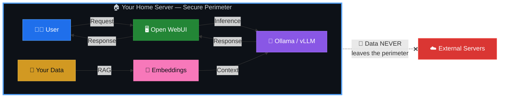
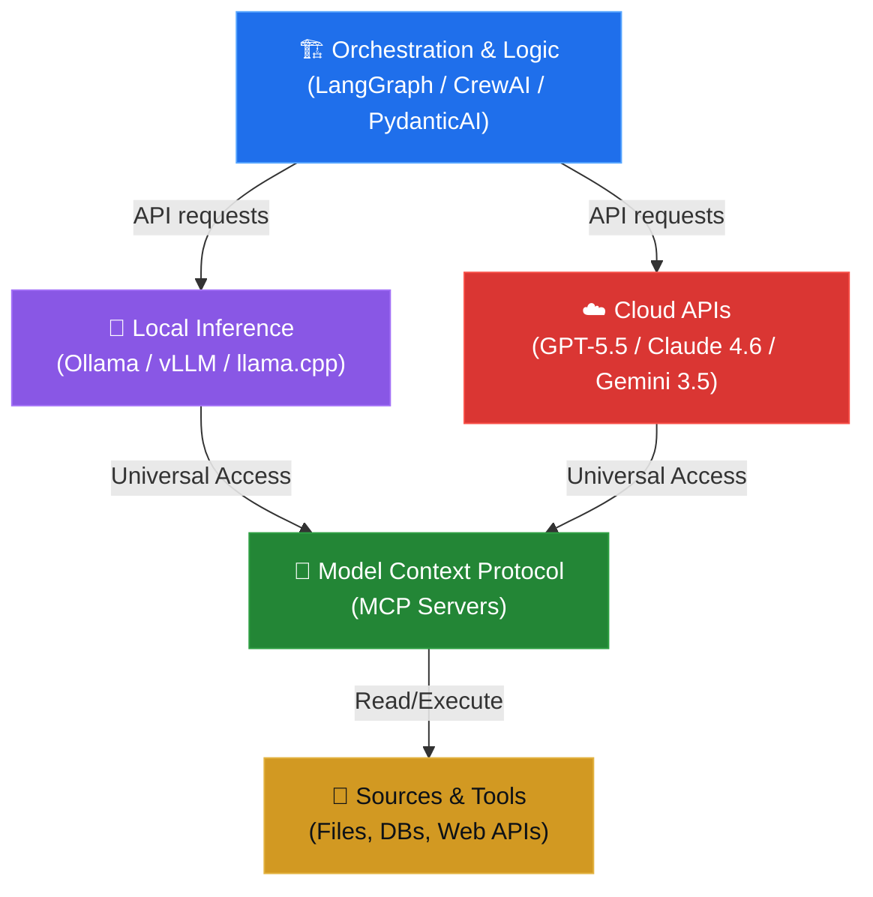

<p align="center">
  <a href="./README.md">🇺🇦 Українська</a> | <strong>🇬🇧 English</strong>
</p>

<p align="center">
  
  
  
  
</p>

<h1 align="center">🧠 AI-HomeLab</h1>
<h3 align="center">Home AI Labs in Ukraine 🇺🇦</h3>

<p align="center">
  <strong>Local AI · Multi-Agent Systems · Blackout Resilience</strong>
</p>

---

Welcome to the central repository of the **AI-HomeLab** initiative! This project is designed to build a culture of responsible, secure, and practical use of AI models and autonomous agents in home environments on a budget within Ukraine.

> **Why is this necessary?** The boundary between a regular ChatGPT user and an engineer who knows how to locally deploy, quantize, and orchestrate AI agents defines the future of the technology job market and digital security in Ukraine.

---

## 📌 TABLE OF CONTENTS

* [📜 Memorandum and Project Philosophy](#-memorandum-and-project-philosophy)
* [⚡ Quick Start](#-quick-start)
* [💻 Minimum Requirements](#-minimum-requirements)
* [🛠️ Repository Structure](#️-repository-structure)
* [📚 Modules and Navigation](#-modules-and-navigation)
* [🗺️ Roadmap](#️-roadmap)
* [🔐 Security](#-security)
* [🤝 Join the Community](#-join-the-community)
* [📄 License](#-license)

---

## 📜 MEMORANDUM AND PROJECT PHILOSOPHY

Every AI-HomeLab community member and repository contributor shares four fundamental principles:

### 1. 🛡️ Technological Hygiene and Security

We **categorically do not use, test, or promote** software, AI models, or tools developed in the Russian Federation or geopolitically risky countries (specifically the PRC, such as DeepSeek, Qwen, etc.).

> [!CAUTION]
> **Prohibited models and tools:** DeepSeek, Qwen, YandexGPT, GigaChat, or any models with unknown or non-transparent dataset origins.

**Our stack is verified Western Open-Source:**

| Category | Tools |
|---|---|
| **LLM Models** | Meta LLaMA 4 (Scout/Maverick), Google Gemma 3/4, Mistral (Large 3 / Medium 3.5 / Small 4), Microsoft Phi-4 (Reasoning/Vision/Multimodal) |
| **Cloud APIs** | OpenAI (GPT-5.5/5.4, GPT-5.4 mini/nano), Anthropic (Claude 4.x / 4.6 / 4.5), Google (Gemini 3.5/3.1) |
| **Inference** | Ollama, vLLM, llama.cpp |
| **Orchestration** | LangGraph, CrewAI, PydanticAI |

### 2. 🔒 Locality and Data Sovereignty

Sensitive Ukrainian data (personal information, internal company documents, local registries) **must not leave the perimeter** of our country or personal computer.

We learn to deploy AI locally (via Ollama/vLLM), ensuring complete autonomy from third-party servers:



### 3. ⚡ Cost and Energy Efficiency

We create solutions adapted to **Ukrainian realities**. This means:

- **Maximum results on consumer hardware** — RTX 3060/4060/5060 or Apple Silicon
- **Use of free/cheap APIs** — Gemini 3.5 Flash / 3.1 Flash-Lite, GPT-5.4 mini for hybrid systems
- **Aggressive model quantization** — Q4/Q8 via GGUF to save VRAM
- **🔋 Blackout Resilience** — optimizing power consumption for stable lab operation from inverters and power stations (EcoFlow, Bluetti) during power outages

> [!TIP]
> A typical home lab consumes **80-150W** — less than an electric kettle. A single 2000Wh power station will last for **13-25 hours** of continuous operation.

### 4. 🚀 Practicality and Career Boost

A home lab is not just a hobby, it is **the best line on your CV**. We focus not on writing "prompts", but on developing complex logic:

- **Multi-agent systems** — autonomous AI agent teams solving complex tasks
- **RAG (Retrieval-Augmented Generation)** — searching and generating based on your documents
- **Type-safe integrations** — robust, production-ready code with validation via Pydantic
- **Real pet projects** — that convert into job offers and successful products

### 5. 🔄 Architectural Component Interaction

A modern home AI lab functions as a three-tier architecture (Orchestration ↔ Inference ↔ Tools), integrated via open and standardized protocols:



* **Orchestration Layer** manages agent logic, conversation state persistence, and strict type validation at the Python level.
* **Inference Layer** executes models locally or invokes cloud engines using compatible APIs (OpenAI/Anthropic Messages API).
* **Tools Layer (MCP)** gives models standardized access to external resources without the need for custom connectors.

---

## ⚡ QUICK START

Deploy your first local AI lab in **3 steps**:

### Step 1: Install Ollama

```bash
curl -fsSL https://ollama.com/install.sh | sh
```

### Step 2: Download a model

```bash
# Lightweight model to start with (~4GB, runs on 8GB RAM)
ollama pull gemma3:4b

# Or a more powerful one (requires 16GB RAM or GPU with 8GB+ VRAM)
ollama pull llama3.1:8b
```

### Step 3: Run the web interface

```bash
docker run -d \
  --name open-webui \
  -p 3000:8080 \
  --add-host=host.docker.internal:host-gateway \
  -v open-webui:/app/backend/data \
  -e OLLAMA_BASE_URL=http://host.docker.internal:11434 \
  --restart always \
  ghcr.io/open-webui/open-webui:main
```

Open `http://localhost:3000` — your local ChatGPT is ready! 🎉

> [!NOTE]
> Detailed instructions for each platform (Windows/macOS/Linux) can be found in the [docs/setup/](./docs/setup/) section.

---

## 💻 MINIMUM REQUIREMENTS

| Component | Minimum | Recommended | Premium |
|---|---|---|---|
| **CPU** | 4 cores (Intel i5/Ryzen 5) | 8 cores (Intel i7/Ryzen 7) | Apple M2 Pro+ |
| **RAM** | 8 GB | 16 GB | 32+ GB |
| **GPU** | — (CPU-only) | RTX 3060 12GB | RTX 4060 Ti 16GB / RTX 5060 |
| **Storage** | 50 GB SSD | 256 GB NVMe | 1 TB NVMe |
| **OS** | Ubuntu 22.04+ / macOS 13+ | Ubuntu 24.04 / macOS 14+ | Proxmox VE 8+ |
| **Power** | 220V outlet | UPS 600VA | EcoFlow + inverter |

> [!IMPORTANT]
> **Apple Silicon (M1/M2/M3/M4)** is the ideal choice for Ukrainian realities: high performance with minimal power consumption (15-30W under load). Runs from any power bank via USB-C.

---

## 🛠️ REPOSITORY STRUCTURE

📂 [**`ai/`**](./)<br>
├── 📁 [**`benchmarks/`**](./benchmarks/) — *Hardware benchmarks and energy efficiency*<br>
│&nbsp;&nbsp;&nbsp;└── ⚡ [**`hardware_efficiency.md`**](./benchmarks/hardware_efficiency.md) — *GPU vs Apple Silicon (t/s/W)*<br>
│<br>
├── 📁 [**`configs/`**](./configs/) — *Ready-made Docker Compose configurations*<br>
│&nbsp;&nbsp;&nbsp;├── ✅ [**`ollama/`**](./configs/ollama/) — *One-click Ollama + Open WebUI*<br>
│&nbsp;&nbsp;&nbsp;├── 🔌 [**`production-agent-stack/`**](./configs/production-agent-stack/) — *Comprehensive Stack (Ollama, LiteLLM, Qdrant, n8n, Open WebUI)*<br>
│&nbsp;&nbsp;&nbsp;├── ⏳ **`vllm/`** — `(coming soon)` *vLLM for production-grade inference*<br>
│&nbsp;&nbsp;&nbsp;└── ⏳ **`dify/`** — `(coming soon)` *Dify AI — no-code agent platform*<br>
│<br>
├── 📁 [**`templates/`**](./templates/) — *Templates and code examples*<br>
│&nbsp;&nbsp;&nbsp;├── 🧠 [**`langgraph_rag_agent.py`**](./templates/langgraph_rag_agent.py) — *Corrective RAG Agent (LangGraph + Qdrant)*<br>
│&nbsp;&nbsp;&nbsp;├── 🤖 [**`agent-code-cli/`**](./templates/agent-code-cli/) — *Claude Code Style Agent CLI (Ollama + Claude)*<br>
│&nbsp;&nbsp;&nbsp;├── 💾 [**`agent_persistent_memory.py`**](./templates/agent_persistent_memory.py) — *Long-term agent memory (SQLite + Ollama)*<br>
│&nbsp;&nbsp;&nbsp;└── 📦 [**`requirements.txt`**](./templates/requirements.txt) — *Shared dependencies for out-of-the-box template usage*<br>
│<br>
├── 📁 **`projects/`** — `(coming soon)` *Ideas and implementations of pet projects*<br>
│&nbsp;&nbsp;&nbsp;├── ⏳ **`local-osint/`** — `(coming soon)` *Local OSINT assistants*<br>
│&nbsp;&nbsp;&nbsp;├── ⏳ **`biz-automation/`** — `(coming soon)` *Business routine automation tools*<br>
│&nbsp;&nbsp;&nbsp;└── ⏳ **`rag-pipeline/`** — `(coming soon)` *RAG pipeline for custom documents*<br>
│<br>
├── 📁 [**`docs/`**](./docs/) — *Documentation and guides*<br>
│&nbsp;&nbsp;&nbsp;├── 📁 [**`research/`**](./docs/research/) — *AI landscape research*<br>
│&nbsp;&nbsp;&nbsp;│&nbsp;&nbsp;&nbsp;├── 🔬 [**`ai-landscape-june-2026.md`**](./docs/research/ai-landscape-june-2026.md) — *AI models and stack report*<br>
│&nbsp;&nbsp;&nbsp;│&nbsp;&nbsp;&nbsp;└── 🚀 [**`free-ai-tools-lifehacks_ENG.md`**](./docs/research/free-ai-tools-lifehacks_ENG.md) — *Free AI Tools and Lifehacks*<br>
│&nbsp;&nbsp;&nbsp;├── 📁 [**`setup/`**](./docs/setup/) — *Step-by-step guides for each OS*<br>
│&nbsp;&nbsp;&nbsp;│&nbsp;&nbsp;&nbsp;├── ⏱️ [**`first-model-15-min.md`**](./docs/setup/first-model-15-min.md) — *Quick start of the first model*<br>
│&nbsp;&nbsp;&nbsp;│&nbsp;&nbsp;&nbsp;├── 🔋 [**`blackout-guide.md`**](./docs/setup/blackout-guide.md) — *Outage energy efficiency guide*<br>
│&nbsp;&nbsp;&nbsp;│&nbsp;&nbsp;&nbsp;├── 🏗️ [**`reference-architectures.md`**](./docs/setup/reference-architectures.md) — *Reference Architectures (Tier 1/2/3)*<br>
│&nbsp;&nbsp;&nbsp;│&nbsp;&nbsp;&nbsp;└── 📊 [**`ai-ops.md`**](./docs/setup/ai-ops.md) — *Metrics, Monitoring & Observability (AIOps)*<br>
│&nbsp;&nbsp;&nbsp;├── 📁 [**`security/`**](./docs/security/) — *Security policies, audits, and model isolation*<br>
│&nbsp;&nbsp;&nbsp;│&nbsp;&nbsp;&nbsp;├── 🛡️ [**`model_isolation.md`**](./docs/security/model_isolation.md) — *Runtime isolation & TEE*<br>
│&nbsp;&nbsp;&nbsp;│&nbsp;&nbsp;&nbsp;├── 🛡️ [**`advanced_hardening.md`**](./docs/security/advanced_hardening.md) — *Deep isolation (VLAN, nftables, Gitleaks)*<br>
│&nbsp;&nbsp;&nbsp;│&nbsp;&nbsp;&nbsp;├── 🛡️ [**`model-vetting.md`**](./docs/security/model-vetting.md) — *Model vetting criteria*<br>
│&nbsp;&nbsp;&nbsp;│&nbsp;&nbsp;&nbsp;└── 🛡️ [**`threat-modeling.md`**](./docs/security/threat-modeling.md) — *Autonomous Agent Threat Modeling*<br>
│&nbsp;&nbsp;&nbsp;├── 📄 [**`templates_ENG.md`**](./docs/templates_ENG.md) — *Code templates and examples guide*<br>
│&nbsp;&nbsp;&nbsp;└── ⏳ **`quantization/`** — `(coming soon)` *Quantization guide (Q4/Q8/GGUF)*<br>
│<br>
├── 📄 [**`README.md`**](./README.md) — *Ukrainian version*<br>
├── 📄 [**`README_ENG.md`**](./README_ENG.md) — *This file (ENG)*<br>
├── 📄 [**`CONTRIBUTING.md`**](./CONTRIBUTING.md) — *Contributor guide*<br>
├── 📄 [**`SECURITY.md`**](./SECURITY.md) — *Security policy*<br>
├── 📄 [**`LICENSE`**](./LICENSE) — *MIT License*<br>
└── 📄 [**`ROADMAP.md`**](./ROADMAP.md) — *Project roadmap*

---

## 📚 MODULES AND NAVIGATION

For convenience, all learning and practical materials in the repository are divided into thematic sections:

### 🚀 1. Quick Start & Basic Infrastructure
| Module & Link | Description | Main Files | Status |
| :--- | :--- | :--- | :--- |
| ⏱️ [**15-Min Setup**](./docs/setup/first-model-15-min.md) | Quick step-by-step launch of Ollama, downloading your first model, and chatting via the Open WebUI Docker container. | [`first-model-15-min.md`](./docs/setup/first-model-15-min.md) | ✅ Done |
| 🐳 [**Ollama + Open WebUI**](./configs/ollama/) | Docker Compose configuration for launching services together (CPU/GPU profiles, secure port binding). | [`docker-compose.yml`](./configs/ollama/docker-compose.yml) | ✅ Done |
| 🏗️ [**Reference Architectures**](./docs/setup/reference-architectures.md) | Reference hardware configurations (Tier 1/2/3) for deploying home AI labs from $300 to $3000+. | [`reference-architectures.md`](./docs/setup/reference-architectures.md) | ✅ Done |
| 🔌 [**Production Agent Stack**](./configs/production-agent-stack/) | Configuration of the full infrastructure stack (Ollama, LiteLLM, Qdrant, n8n, Open WebUI) for multi-agent systems. | [`docker-compose.yml`](./configs/production-agent-stack/docker-compose.yml) | ✅ Done |
| 🚀 [**Free AI Tools & Hacks**](./docs/research/free-ai-tools-lifehacks_ENG.md) | List of free development tools and 7 practical lifehacks to improve model response quality. | [`free-ai-tools-lifehacks_ENG.md`](./docs/research/free-ai-tools-lifehacks_ENG.md) | ✅ Done |

### 🧠 2. Development, Templates & Agents
| Module & Link | Description | Main Files | Status |
| :--- | :--- | :--- | :--- |
| 🤖 [**Agent CLI**](./templates/agent-code-cli/) | Claude Code style console AI agent (secure working directory, bash execution with permission, interactive diff preview). | [`cli.py`](./templates/agent-code-cli/agent_code/cli.py) | ✅ Done |
| 🧠 [**CRAG Agent**](./templates/langgraph_rag_agent.py) | Corrective RAG (CRAG) agent built with LangGraph + Qdrant using a cyclic evaluation and query reformulation graph. | [`langgraph_rag_agent.py`](./templates/langgraph_rag_agent.py) | ✅ Done |
| 🧠 [**Agent Memory**](./templates/agent_persistent_memory.py) | Session-persistent long-term memory template (SQLite + Ollama nomic-embed-text) for saving facts and decisions between runs. | [`agent_persistent_memory.py`](./templates/agent_persistent_memory.py) | ✅ Done |
| 📄 [**Templates Guide**](./docs/templates_ENG.md) | Comprehensive step-by-step guide for setting up and running all repository code templates. | [`templates_ENG.md`](./docs/templates_ENG.md) | ✅ Done |

### ⚡ 3. Hardware & Energy Efficiency
| Module & Link | Description | Main Files | Status |
| :--- | :--- | :--- | :--- |
| 🔋 [**Blackout Guide**](./docs/setup/blackout-guide.md) | Configuring the lab to operate during power outages (Nvidia Power Limit, CPU thread limits, running from EcoFlow, Starlink 12V PoE, Tailscale, Offline RAG). | [`blackout-guide.md`](./docs/setup/blackout-guide.md) | ✅ Done |
| ⚡ [**Hardware Benchmarks**](./benchmarks/hardware_efficiency.md) | Comprehensive analysis of GPU vs Apple Silicon (tokens/second/Watt), cold start analysis, and VRAM contention. | [`hardware_efficiency.md`](./benchmarks/hardware_efficiency.md) | ✅ Done |
| 📊 [**AIOps & Observability**](./docs/setup/ai-ops.md) | Monitoring hardware (GPU Power Draw), inference metrics (Ollama/vLLM /metrics), and agent tracing via Langfuse. | [`ai-ops.md`](./docs/setup/ai-ops.md) | ✅ Done |

### 🛡️ 4. Security, Hardening & Model Isolation
| Module & Link | Description | Main Files | Status |
| :--- | :--- | :--- | :--- |
| 🛡️ [**Advanced Hardening**](./docs/security/advanced_hardening.md) | VLAN isolation of the IoT segment, nftables firewall for Proxmox host, Docker daemon security, and Gitleaks pre-commit linter. | [`advanced_hardening.md`](./docs/security/advanced_hardening.md) | ✅ Done |
| 🛡️ [**Model Isolation**](./docs/security/model_isolation.md) | Model execution isolation using gVisor, Firecracker, WASM, Trusted Execution Environments (TEE), and Zero-Trust networks. | [`model_isolation.md`](./docs/security/model_isolation.md) | ✅ Done |
| 🛡️ [**Model Vetting**](./docs/security/model-vetting.md) | Model vetting criteria (model hygiene, inference privacy, safe formats GGUF/Safetensors, and licensing compliance). | [`model-vetting.md`](./docs/security/model-vetting.md) | ✅ Done |
| 🛡️ [**Threat Modeling**](./docs/security/threat-modeling.md) | Threat modeling for autonomous agents (Prompt Injection, Tool Poisoning, Agent Escape, Secrets Leakage). | [`threat-modeling.md`](./docs/security/threat-modeling.md) | ✅ Done |
| 🔐 [**Security Policy**](./SECURITY.md) | Overall project security policies, model hygiene, sensitive data isolation, and credential management. | [`SECURITY.md`](./SECURITY.md) | ✅ Done |

### 🔬 5. Strategy, Roadmap & Community
| Module & Link | Description | Main Files | Status |
| :--- | :--- | :--- | :--- |
| 🔬 [**AI Landscape 2026**](./docs/research/ai-landscape-june-2026.md) | AI market analysis as of June 2026: models, APIs, frameworks, RAG, MCP, stealth browsers, and assistants. | [`ai-landscape-june-2026.md`](./docs/research/ai-landscape-june-2026.md) | ✅ Done |
| 🗺️ [**Roadmap**](./ROADMAP.md) | Detailed project roadmap: Phase 1 (Foundation), Phase 2 (Practice), Phase 3 (Community). | [`ROADMAP.md`](./ROADMAP.md) | ✅ Done |
| 🤝 [**Contributing**](./CONTRIBUTING.md) | Contributor guide: creating Issues, working on feature branches, and submitting Pull Requests. | [`CONTRIBUTING.md`](./CONTRIBUTING.md) | ✅ Done |

---

## 🗺️ ROADMAP

> [!NOTE]
> As of **June 2026 (06.2026)**, Phase 1 (Foundation) has been fully completed ahead of schedule! The project is actively working on Phase 2 tasks.

### 🏁 Phase 1 — Foundation (Q3 2026) — 🎉 Completed ahead of schedule!
- [x] Memorandum and project philosophy
- [x] Docker Compose for Ollama + Open WebUI
- [x] Benchmarks of RTX 3060/4060/5060 with quantized models
- [x] Guide: "First model in 15 minutes"
- [x] LangGraph RAG pipeline template (CRAG Agent)
- [x] Deep isolation of home lab (Advanced Hardening)
- [x] Energy efficiency benchmarks (t/s/W)
- [x] Console AI coding agent (Claude Code style CLI)

### 🚀 Phase 2 — Practice (Q4 2026) — ⏳ In Progress
- [ ] LangGraph / PydanticAI multi-agent template for business automation
- [x] Blackout guide: configuring the lab to run on EcoFlow, Starlink 12V PoE, Tailscale, Offline RAG
- [ ] Local OSINT assistant (pet project using local maps and offline RAG knowledge)
- [ ] Stealth automation and web workflow template (based on CloakBrowser experience)
- [x] Session memory integration (AgentMemory) into agent templates
- [ ] Local Deep Research agent on LangGraph / PydanticAI (SearXNG/DuckDuckGo integration)
- [ ] Docker Compose stack for offline knowledge base (Kiwix + Wikipedia) and RAG connector
- [ ] Guide and compose configs for local MCP servers (Filesystem, SQLite, Fetch)
- [ ] Production Docker Compose config for Dify (no-code orchestration & RAG platform)
- [ ] Guide on configuring local coding tools (Continue.dev, Aider, Tabby) with SLM models (Phi-4, Gemma 3/4)
- [ ] Webinar/livestream: "AI-HomeLab Live Setup"

### 🌟 Phase 3 — Community (Q1 2027) — 📅 Planned
- [ ] Telegram bot for automated benchmarks
- [ ] CI/CD pipeline for automated model vulnerability testing
- [ ] Starter AI-HomeLab Dashboard (portal for local services integration)
- [ ] Guide on configuring Compare Mode (split testing of models) in Open WebUI
- [ ] Practical guide on vLLM optimization (PagedAttention, KV Cache Offloading, Multi-Token Prediction)
- [ ] Local Speech-to-Speech voice assistant using native multimodal models (Gemma 3n, Phi-4 Multimodal)
- [ ] Partnerships with Ukrainian AI communities
- [ ] Monthly digest of new models and tools

---

## 🔐 SECURITY

We take security seriously. Before using any model in your lab:

1. **Verify origin** — the model must have a transparent license and known dataset sources
2. **Isolate environment** — run models in Docker containers or virtual machines
3. **Do not share sensitive data** — only send anonymized data to cloud APIs
4. **Update regularly** — track CVEs and security updates for tools

> Read more: [`SECURITY.md`](./SECURITY.md)

---

## 🤝 JOIN THE COMMUNITY

### 💬 Communication Channels

| Platform | Link | Purpose |
|---|---|---|
| **Telegram** | *Coming soon* | Discussion of hardware, architecture, GPU trade |
| **GitHub Discussions** | [Discussions](https://github.com/weby-homelab/ai/discussions) | Questions, ideas, RFCs |
| **Issues** | [Issues](https://github.com/weby-homelab/ai/issues) | Bug reports and feature requests |

### 🤲 How to Contribute

Found a cool model, optimized a config for EcoFlow, or wrote a useful local agent?

1. **Fork** this repository
2. Create an **Issue** describing your idea
3. Create a branch `feature/your-feature`
4. Make a **Pull Request** with a detailed description

> Read more: [`CONTRIBUTING.md`](./CONTRIBUTING.md)

---

## 📄 License

This project is licensed under the [MIT License](./LICENSE).

---

<p align="center">
  <strong>🇺🇦 Let's build Ukraine's AI future together!</strong>
</p>

<p align="center">
  <sub>Created with ❤️ for the Ukrainian tech community</sub>
</p>
