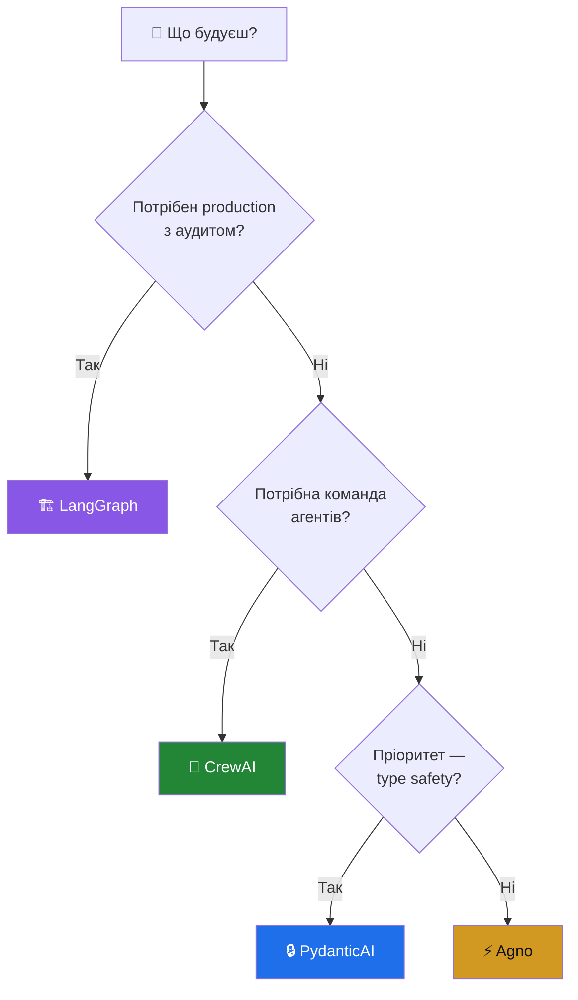
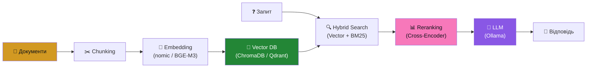

# 🔬 AI-HomeLab: Дослідження ландшафту ШІ — Червень 2026

> **Мета:** Сформувати в Україні культуру відповідального, безпечного та практичного використання ШІ з обмеженим бюджетом для домашнього використання, розвитку кар'єри та пет-проєктів.

> [!NOTE]
> Цей документ охоплює **виключно** західний та демократичний стек. Моделі та інструменти з РФ та КНР (DeepSeek, Qwen, YandexGPT, GigaChat) **навмисно виключені** згідно з [Меморандумом проєкту](../../README.md).

---

## 📑 Зміст

1. [Хмарні AI-моделі та API](#-хмарні-ai-моделі-та-api)
2. [Відкриті моделі для локального запуску](#-відкриті-моделі-для-локального-запуску)
3. [Інструменти локального інференсу](#-інструменти-локального-інференсу)
4. [Агентні фреймворки та оркестрація](#-агентні-фреймворки-та-оркестрація)
5. [RAG та векторні бази даних](#-rag-та-векторні-бази-даних)
6. [MCP — Model Context Protocol](#-mcp--model-context-protocol)
7. [Self-hosted AI платформи](#-self-hosted-ai-платформи)
8. [Залізо для домашньої лабораторії](#-залізо-для-домашньої-лабораторії)
9. [Бюджетні тієри для України](#-бюджетні-тієри-для-україни)
10. [Блекаут-резилієнтність](#-блекаут-резилієнтність)
11. [Рекомендований стек для початку](#-рекомендований-стек-для-початку)
12. [Автономні Локальні Агенти та Нові Напрямки (Червень 2026)](#-автономні-локальні-агенти-та-нові-напрямки-червень-2026)

---

## ☁️ Хмарні AI-моделі та API

### Порівняння цін (за 1M токенів, USD)

| Провайдер | Модель | Input | Output | Контекст | Тип | Найкраще для |
|---|---|---|---|---|---|---|
| **Google** | Gemini 2.5 Flash-Lite | $0.10 | $0.40 | 1M | API | 🏆 Найдешевший варіант для навчання |
| **Google** | Gemini 2.5 Flash | $0.30 | $2.50 | 1M | API | Швидкі задачі, прототипи |
| **Google** | Gemini 2.5 Pro | $1.25 | $10.00 | 1M | API | Складне міркування, код |
| **Google** | Gemini 3 Flash | $0.50 | $3.00 | 1M | API | Збалансована продуктивність |
| **Google** | Gemini 3.1 Pro | $2.00 | $12.00 | 1M | API | Максимальна якість |
| **OpenAI** | GPT-4.1 nano | $0.10 | $0.40 | 1M | API | Дешеві масові задачі |
| **OpenAI** | GPT-4.1 mini | $0.40 | $1.60 | 1M | API | Баланс ціна/якість |
| **OpenAI** | GPT-4.1 | $2.00 | $8.00 | 1M | API | Production, код, агенти |
| **OpenAI** | o4-mini | $1.10 | $4.40 | — | API | Reasoning, математика |
| **OpenAI** | o3 | $2.00 | $8.00 | — | API | Найкраще міркування |
| **Anthropic** | Claude Haiku 4.5 | $1.00 | $5.00 | 200K | API | Швидкі, дешеві задачі |
| **Anthropic** | Claude Sonnet 4.6 | $3.00 | $15.00 | 200K | API | Код, аналіз, агенти |
| **Anthropic** | Claude Opus 4.8 | $5.00 | $25.00 | 200K | API | Найкраща якість |
| **Mistral** | Small 4 | $0.15 | $0.60 | 256K | API + Open | Легкі задачі, edge, агенти (Березень 2026) |
| **Mistral** | Codestral | $0.30 | $0.90 | 256K | API + Open | Код |
| **Mistral** | Medium 3.5 | $1.50 | $7.50 | 262K | API + Open | Фронтьєр, кодування, агенти |
| **Mistral** | Large 3 | $0.50 | $1.50 | 262K | API + Open | Складні задачі, мультимова |

### 🆓 Безкоштовні тієри для навчання

| Провайдер | Що безкоштовно | Обмеження |
|---|---|---|
| **Google AI Studio** | Gemini 2.5 Flash, Flash-Lite | Знижені RPM/TPM, дані можуть використовуватись для навчання |
| **OpenAI** | GPT-4.1 nano (безкоштовний тієр) | ~1000 запитів/день |
| **Mistral** | Le Chat (чат) | Безкоштовний чат, API за $14.99/міс |
| **Google Colab** | Безкоштовні GPU (T4) | Обмежений час, нестабільно |

### 💡 Оптимізація витрат

- **Prompt Caching** — до 90% знижка (Anthropic), 75% (OpenAI) на кешовані токени
- **Batch API** — 50% знижка на асинхронні запити (всі провайдери)
- **Маршрутизація моделей** — Haiku для простих задач, Sonnet/Opus для складних

> [!TIP]
> **Бюджет $10/міс** = ~100M токенів Gemini Flash-Lite або ~25M GPT-4.1 nano. Цього достатньо для активного навчання та пет-проєктів.

---

## 🧠 Відкриті моделі для локального запуску

### Моделі, що працюють на споживчому залізі

| Модель | Параметри | Ліцензія | Мультимодальність | VRAM (Q4) | Найкраще для |
|---|---|---|---|---|---|
| **Gemma 3** 4B | 4B | Google Open | ✅ Текст + Vision | ~3 GB | 🏆 Ідеал для початку, 128K контекст |
| **Gemma 3** 12B | 12B | Google Open | ✅ Текст + Vision | ~7 GB | Баланс якість/розмір |
| **Gemma 3** 27B | 27B | Google Open | ✅ Текст + Vision | ~16 GB | Найкраща якість серед SLM |
| **Gemma 4** E2B / E4B | 2B / 4B | Apache 2.0 | ✅ Мультимодальна | ~1.5 - 3 GB | Edge-пристрої, висока швидкість (Квітень 2026) |
| **Gemma 4** 26B (MoE) | 4B active / 26B total | Apache 2.0 | ✅ Мультимодальна | ~6 GB* | Робочі станції, 256K контекст |
| **Gemma 4** 31B | 31B dense | Apache 2.0 | ✅ Мультимодальна | ~20 GB | Флагманська якість, 256K контекст |
| **Phi-4 mini** | 3.8B | MIT | ❌ Текст | ~2.5 GB | Reasoning, математика, код |
| **Phi-4** | 14B | MIT | ❌ Текст | ~8 GB | Найкраще міркування серед SLM |
| **Phi-4 Multimodal** | 5.6B | MIT | 🗣️ Text + Audio + Image | ~4 GB | Мультимедійні інструкції |
| **Phi-4 Reasoning** | 14B | MIT | ❌ Текст | ~8 GB | RL-міркування, покрокова логіка |
| **Phi-4 Reasoning-Vision** | 15B | MIT | ✅ Текст + Vision | ~9 GB | Аналітика, вибірковий CoT (Березень 2026) |
| **Mistral Small 4** | 24B | Apache 2.0 | ❌ Текст | ~14 GB | Мультимова, агенти, код (Березень 2026) |
| **Mistral Medium 3.5** | 128B | Open-weight | ✅ Мультимодальна | ~70 GB | Фронтьєр-клас, кодування, агенти |
| **Mistral Large 3** | 675B total MoE | Open-weight | ✅ Мультимодальна | ~48 GB* | Флагман для складних завдань |
| **Ministral 3** 3B/8B/14B | 3B/8B/14B | Open-weight | ❌ Текст | ~2 - 8 GB | Edge-інференс, низька затримка |
| **LLaMA 4 Scout** | 17B active / 109B total | Llama License | ✅ Мультимодальна | ~12 GB* | MoE, 10M контекст, енергоефективна |
| **LLaMA 4 Maverick** | 17B active / 400B total | Llama License | ✅ Мультимодальна | ~48 GB* | MoE, найкраща якість, 1M контекст |

*\*MoE-архітектура: VRAM залежить від кількості завантажених експертів*

### Рекомендації по VRAM

| VRAM | Що запускати (Q4_K_M) |
|---|---|
| **8 GB** | Gemma 3 4B, Gemma 4 E2B/E4B, Phi-4 mini 3.8B, Phi-4 Multimodal 5.6B, Phi-4 14B (дуже тісно) |
| **12 GB** | Phi-4 14B, Phi-4 Reasoning 14B, Gemma 3 12B, Ministral 3 (3B/8B) |
| **16 GB** | Gemma 3 27B, Gemma 4 26B (MoE), Mistral Small 4 (24B), Phi-4 Reasoning-Vision 15B |
| **24 GB** (M1 Max/M4 Max) | Gemma 4 31B, Gemma 3 27B у повній якості, Ministral 3 14B |
| **32+ GB** (Mac Unified) | LLaMA 4 Scout повністю (MoE 109B), Mistral Small 4, паралельні моделі |
| **96+ GB** (Mac Ultra / Multi-GPU) | LLaMA 4 Maverick (MoE 400B), Mistral Medium 3.5, Mistral Large 3 |

---

## 🔧 Інструменти локального інференсу

### Порівняння інструментів (2026)

| Інструмент | Найкраще для | GPU підтримка | Складність | Ключова перевага |
|---|---|---|---|---|
| **Ollama** | Розробка та прототипи | NVIDIA, AMD, Apple Silicon | ⭐ Легко | Запуск за 1 команду |
| **vLLM** | Production, API для команди | NVIDIA (CUDA) | ⭐⭐⭐ Складно | PagedAttention, throughput |
| **llama.cpp** | Портативність, edge | Все (CPU, Metal, CUDA, ROCm) | ⭐⭐ Середньо | Максимальний контроль |
| **LM Studio** | Візуальний UI, новачки | NVIDIA, Apple Silicon | ⭐ Легко | Гарний GUI, drag-and-drop |
| **Jan.ai** | Desktop-клієнт | NVIDIA, Apple Silicon | ⭐ Легко | Приватність, локальний ChatGPT |
| **Open WebUI** | Веб-інтерфейс для команди | Через Ollama/vLLM | ⭐ Легко | RAG, плагіни, RBAC |
| **LocalAI** | OpenAI-сумісний API | NVIDIA, CPU | ⭐⭐ Середньо | Drop-in заміна OpenAI |

### 🏗️ Рекомендована стратегія 2026

```
┌─────────────────────────────────────────────────────────┐
│  1. ПРОТОТИПУЙ в Ollama  — найшвидший шлях до моделі   │
│  2. МАСШТАБУЙ у vLLM     — коли потрібен API для команди│
│  3. ВБУДОВУЙ llama.cpp   — edge, офлайн, контроль      │
└─────────────────────────────────────────────────────────┘
```

### Квантизація: що обирати?

| Формат | Розмір (% від FP16) | Якість | Коли використовувати |
|---|---|---|---|
| **Q4_K_M** | ~25% | 🟢 Мінімальна втрата | 🏆 **Золотий стандарт** — баланс якість/розмір |
| **Q5_K_M** | ~31% | 🟢 Відмінна | Якщо є трохи більше VRAM |
| **Q8_0** | ~50% | 🟢 Майже без втрат | Якщо вистачає VRAM |
| **Q3_K_M** | ~19% | 🟡 Помітна втрата | Тільки при критичному дефіциті VRAM |
| **Q2_K** | ~12% | 🔴 Суттєва втрата | Не рекомендовано |

---

## 🤖 Агентні фреймворки та оркестрація

### Порівняння фреймворків

| Фреймворк | Тип | Підтримка Ollama | Складність | Найкраще для |
|---|---|---|---|---|
| **LangGraph** | Графові системи | ✅ | ⭐⭐⭐ | 🏆 Production, складні workflow |
| **CrewAI** | Мультиагентні команди | ✅ | ⭐⭐ | Швидкі прототипи, ролі |
| **PydanticAI** | Type-safe агенти | ✅ | ⭐⭐ | Надійний Python-код |
| **AutoGen** (Microsoft) | Конверсаційні агенти | ✅ | ⭐⭐⭐ | Дослідження, R&D |
| **Agno** (ex-PhiData) | Lightweight тулкіт | ✅ | ⭐ | Швидкий старт |
| **Semantic Kernel** (MS) | Enterprise SDK | ✅ | ⭐⭐⭐ | .NET / Java / Python |

### Коли який обирати?



### Тренди 2026

- **Конвергенція:** Команди комбінують CrewAI (для дослідження) + LangGraph (для виконання)
- **MCP як стандарт:** Всі фреймворки переходять на Model Context Protocol для інтеграції з інструментами
- **Human-in-the-loop:** Production-системи обов'язково включають людський контроль

---

## 📚 RAG та векторні бази даних

### Вибір векторної БД

| Рішення | Найкраще для | Мова | Self-hosted | Складність |
|---|---|---|---|---|
| **ChromaDB** | 🏆 Прототипи, навчання | Python | ✅ | ⭐ |
| **pgvector** | Якщо вже є PostgreSQL | SQL | ✅ | ⭐⭐ |
| **Qdrant** | Production, перформанс | Rust | ✅ + Cloud | ⭐⭐ |
| **Weaviate** | Гібридний пошук | Go | ✅ + Cloud | ⭐⭐⭐ |
| **Milvus Lite** | Великі масштаби | Go/C++ | ✅ | ⭐⭐⭐ |

### Моделі ембедінгів для локального запуску

| Модель | Розмір | Якість | Мультимова | Запуск через |
|---|---|---|---|---|
| **nomic-embed-text** | 137M | 🟢 Добра | ✅ | Ollama |
| **BGE-M3** | 568M | 🟢🟢 Відмінна | ✅ 100+ мов | HuggingFace |
| **E5-mistral-7b** | 7B | 🟢🟢🟢 Найкраща | ✅ | Ollama/vLLM |
| **mxbai-embed-large** | 335M | 🟢🟢 Відмінна | ✅ | Ollama |

### Сучасний RAG-стек 2026



---

## 🔌 MCP — Model Context Protocol

### Що це?
**MCP** — відкритий стандарт від Anthropic (тепер під Linux Foundation), що вирішує проблему N×M інтеграцій між AI-клієнтами та інструментами. Замість окремого коду для кожної пари "модель ↔ інструмент", MCP створює **єдиний універсальний протокол**.

### Архітектура

```
┌──────────────┐     MCP      ┌──────────────┐
│  AI Host     │◄────────────►│  MCP Server  │
│ (Claude,     │  (JSON-RPC)  │ (GitHub,     │
│  Cursor,     │              │  Slack, DB,  │
│  VS Code)    │              │  Files...)   │
└──────────────┘              └──────────────┘
```

### Чому це важливо для домашньої лабораторії?
- **Агенти отримують реальні дані** — прямий доступ до БД, файлів, API
- **Менше галюцинацій** — модель працює з верифікованою інформацією
- **Мультиагентні системи** — агенти координуються через стандартний протокол
- **Vendor-neutral** — підтримують Google, OpenAI, Microsoft, Anthropic, AWS

### Ключові зміни 2025–2026
- Передано **Agentic AI Foundation** (Linux Foundation) — став індустріальним стандартом
- Додано **MCP Apps** — інтерактивні HTML-інтерфейси всередині чату
- Рух до **stateless дизайну** для масштабування

---

## 🖥️ Self-hosted AI платформи

### Тришарова архітектура 2026

| Шар | Інструмент | Роль |
|---|---|---|
| **Моделі** | Ollama / vLLM | Запуск LLM локально |
| **Інтелект** | Dify | Створення AI-додатків, RAG, агенти |
| **Автоматизація** | n8n | Інтеграція з зовнішніми сервісами |
| **Інтерфейс** | Open WebUI | Чат, RAG, робоче середовище |

### Порівняння платформ

| Платформа | Фокус | Підтримка Ollama | Складність | Найкраще для |
|---|---|---|---|---|
| **Open WebUI** | Чат + RAG | ✅ Native | ⭐ | 🏆 Щоденний AI-воркспейс |
| **Dify** | AI-додатки, агенти | ✅ | ⭐⭐ | Побудова AI-продуктів |
| **n8n** | Workflow автоматизація | ✅ (через API) | ⭐⭐ | Бізнес-процеси |
| **Flowise** | Візуальний LangChain | ✅ | ⭐ | No-code RAG |
| **LibreChat** | Мульти-провайдер чат | ✅ | ⭐ | Альтернатива Open WebUI |

---

## 💻 Залізо для домашньої лабораторії

### GPU порівняння для AI інференсу

| GPU | VRAM | Bandwidth | TDP | Ціна (USD)* | Сильна сторона |
|---|---|---|---|---|---|
| **RTX 3060** | 12 GB | 360 GB/s | 170W | ~$200 (б/у) | 🏆 **Бюджетний король** — 12GB VRAM! |
| **RTX 4060** | 8 GB | 272 GB/s | 115W | ~$300 | Енергоефективна, але 8GB мало |
| **RTX 4060 Ti 16GB** | 16 GB | 288 GB/s | 165W | ~$450 | Солідний вибір, 16GB |
| **RTX 5060** | 8 GB | 448 GB/s | 150W | ~$350 | Найшвидша серед "60-х" |
| **RTX 5070** | 12 GB | 672 GB/s | 250W | ~$550 | Преміум, висока bandwidth |

*\*Приблизні ціни на український ринок, травень 2026*

> [!WARNING]
> **"Пастка 8GB VRAM":** RTX 4060 та RTX 5060 мають лише 8GB. Для серйозної роботи з LLM обирайте GPU з **12+ GB VRAM**. Старший RTX 3060 12GB часто корисніший за новіший RTX 4060 8GB!

### Apple Silicon для AI

| Чіп | Unified Memory | Bandwidth | TDP | Ціна Mac (USD)* | Сильна сторона |
|---|---|---|---|---|---|
| **M1** | 8–16 GB | 68 GB/s | 15W | ~$500 (б/у) | Мінімальний вхід |
| **M2** | 8–24 GB | 100 GB/s | 22W | ~$700 (б/у) | Хороший баланс |
| **M3** | 8–24 GB | 100 GB/s | 22W | ~$900 | Кращий GPU |
| **M4** | 16–32 GB | 120 GB/s | 22W | ~$1100 | Новіша архітектура |
| **M4 Pro** | 24–48 GB | 273 GB/s | 30W | ~$1800 | 🏆 **Ідеал для блекаутів** |
| **M4 Max** | 36–128 GB | 546 GB/s | 40W | ~$2800+ | Максимальна продуктивність |

> [!TIP]
> **Apple Silicon** — ідеальна платформа для українських реалій:
> - **15-40W** під повним навантаженням (RTX 3060 споживає 170W!)
> - Unified Memory = модель бачить всю RAM як VRAM
> - Працює від повербанку через USB-C
> - MLX backend в Ollama дає +20-90% швидкості

### Ключовий інсайт: Bandwidth > Compute

LLM-інференс **memory-bound**, а не compute-bound. Для швидкості генерації (tokens/s) bandwidth пам'яті важливіший за кількість CUDA-ядер:

```
tokens/s ≈ memory_bandwidth / (model_size_in_bytes)
```

Тому RTX 5060 (448 GB/s) генерує швидше за RTX 4060 (272 GB/s) при однаковому розмірі моделі.

---

## 💰 Бюджетні тієри для України

### Тієр 0: Безкоштовно (Cloud-only)
> *Для тих, хто тільки починає*

- Google AI Studio (Gemini Flash безкоштовно)
- Google Colab (T4 GPU безкоштовно)
- Ollama на наявному ноутбуці (Gemma 3 4B на CPU)
- **Що можна:** Вивчити основи, прототипувати промпти, спробувати агентів

### Тієр 1: $100–300 (Мінімальна лабораторія)
> *Б/у GPU або Apple Silicon*

| Варіант | Ціна | Що запускати |
|---|---|---|
| RTX 3060 12GB (б/у) + старий ПК | ~$200 | Phi-4 (14B/mini), Gemma 3/4 12B |
| MacBook Air M1 16GB (б/у) | ~$500 | Gemma 3/4 (4B-12B), Phi-4 mini |
| Raspberry Pi 5 + API | ~$100 | Тільки API, тонкий клієнт |

### Тієр 2: $300–700 (Збалансована лабораторія)
> *Серйозна робота з моделями*

| Варіант | Ціна | Що запускати |
|---|---|---|
| RTX 4060 Ti 16GB + ПК | ~$700 | Gemma 3/4 26B/27B, Mistral Small 4 |
| MacBook Air M2 24GB (б/у) | ~$800 | Будь-яка модель до 15B |
| Mini PC + RTX 3060 12GB | ~$500 | Виділений сервер 24/7 |

### Тієр 3: $700–1500 (Просунута лабораторія)
> *Production-рівень, мультиагентні системи*

| Варіант | Ціна | Що запускати |
|---|---|---|
| Mac Mini M4 Pro 48GB | ~$1800 | LLaMA 4 Scout (109B), Mistral Small 4 |
| RTX 5070 12GB + збірка | ~$1200 | Швидкий інференс, RAG |
| Proxmox сервер + GPU | ~$1000 | Повна лабораторія з ізоляцією |

### Тієр 4: $1500+ (Преміум)
> *Дослідження, великі моделі*

| Варіант | Ціна | Що запускати |
|---|---|---|
| MacBook Pro M4 Max 128GB | ~$3500 | Будь-яка модель, production |
| 2× RTX 3090 24GB (б/у) | ~$1600 | LLaMA 4 Scout/Maverick |
| Виділений сервер Hetzner | ~$50/міс | Cloud GPU на вимогу |

---

## 🔋 Блекаут-резилієнтність

### Споживання типових конфігурацій

| Конфігурація | Idle | AI Load | Від EcoFlow 1024Wh |
|---|---|---|---|
| MacBook Air M2 | 5W | 22W | **~46 годин** |
| Mac Mini M4 | 7W | 30W | **~34 години** |
| Mac Mini M4 Pro | 10W | 40W | **~25 годин** |
| Mini PC + RTX 3060 | 40W | 210W | **~5 годин** |
| Full Tower + RTX 4060 Ti | 80W | 280W | **~3.5 години** |

### Рекомендації

1. **Apple Silicon** — безумовний лідер для блекаутів (15-40W)
2. **GPU power limit** — `nvidia-smi -pl 100` знижує TDP RTX 3060 з 170W до 100W з втратою лише ~15% продуктивності
3. **EcoFlow Delta 2** (1024Wh) — оптимальний вибір для домашньої лаби
4. **UPS + mini PC** — APC Back-UPS 600VA дає 15-30 хвилин для graceful shutdown
5. **Auto-shutdown скрипт** — моніторинг заряду через `apcaccess` або SNMP

> [!IMPORTANT]
> При тривалих блекаутах перемикайтесь на **хмарний режим** (Gemini Flash-Lite API) — мінімальні витрати при максимальній доступності.

---

## 🎯 Рекомендований стек для початку

### Для абсолютного новачка (бюджет: $0)

```
Google AI Studio (Gemini Flash) → вивчити промпт-інженерію
                ↓
Ollama + Gemma 3 4B / Gemma 4 E4B (на наявному ноуті) → перший локальний досвід
                ↓
Open WebUI → зручний інтерфейс
```

### Для розробника-початківця (бюджет: $10-50/міс)

```
Ollama + Gemma 3/4 12B/26B / Phi-4 14B → локальний інференс
        +
Gemini Flash API (резерв) → складні задачі
        +
LangGraph + ChromaDB → перший RAG-проєкт
        +
Open WebUI → щоденний робочий інтерфейс
```

### Для досвідченого інженера (бюджет: $50-200/міс)

```
vLLM + Mistral Small 4 (24B) → production API
        +
Claude Sonnet API → код-рев'ю, складний аналіз
        +
LangGraph + Qdrant → production RAG
        +
Dify + n8n → автоматизація бізнес-процесів
        +
MCP → інтеграція з зовнішніми системами
```

### Кар'єрний ліфт: що додати в CV

| Навичка | Рівень | Як продемонструвати |
|---|---|---|
| Локальне розгортання LLM | Junior | Docker Compose + Ollama + Open WebUI |
| RAG-пайплайн | Mid | LangGraph + ChromaDB + embedding model |
| Мультиагентна система | Mid-Senior | CrewAI / LangGraph + інструменти |
| Production API з vLLM | Senior | vLLM + моніторинг + auto-scaling |
| MCP інтеграції | Senior | Кастомні MCP-сервери |
| Fine-tuning | Expert | QLoRA + Unsloth + evaluation |

---

## 🤖 Автономні Локальні Агенти та Нові Напрямки (Червень 2026)

Зміна вектору розвитку ШІ у 2026 році демонструє відхід від простого використання потужних хмарних LLM до створення автономних локальних екосистем, що фокусуються на трьох ключових стовпах: **локальність**, **стійка сесійна пам'ять** та **stealth-автоматизація**.

Нижче наведено глибокий аналіз 5 знакових GitHub-проєктів (виділених у червневих медіа-оглядах), які задають цей тренд, та варіанти інтеграції їхнього досвіду в концепцію домашніх AI-лабораторій:

### 1. OpenHuman — Персональний AI без хмари
* **Репозиторій:** [tinyhumansai/openhuman](https://github.com/tinyhumansai/openhuman)
* **Суть:** Локальний персональний асистент, що об'єднує дані користувача (пошта, документи, календар) з локальними SLM, забезпечуючи 100% приватність без звернення до зовнішніх API.
* **Аналіз для HomeLab:** Повністю відповідає філософії суверенітету даних. Використання OpenHuman демонструє, як звичайний ПК перетворюється на персонального ШІ-дворецького. В HomeLab-інфраструктурі OpenHuman може інтегруватися як локальний бекенд-асистент, що працює через Ollama та взаємодіє з користувачем через безпечний локальний API.
* **Вимоги до заліза:** Легко працює на базовому тиєрі (16-32 GB RAM, процесори сімейства Apple Silicon або Intel i7/Ryzen 7 з легкими моделями типу Gemma 3 4B / Phi-4 mini).

### 2. CloakBrowser — Stealth-автоматизація та Web Workflow
* **Репозиторій:** [CloakHQ/CloakBrowser](https://github.com/CloakHQ/CloakBrowser)
* **Суть:** Спеціалізований stealth-браузер для автоматизації складних web-сценаріїв (web scraping, OSINT, QA), який імітує поведінку реального користувача для запобігання блокуванням (Cloudflare, CAPTCHA).
* **Аналіз для HomeLab:** Критичний інструмент для локальних OSINT-помічників та бізнес-автоматизаторів (запланованих на Фазу 2 Roadmap). Звичайні headless-бібліотеки (Puppeteer/Playwright) часто блокуються сучасними системами захисту. Інтеграція підходу CloakBrowser у наші шаблони дозволить ШІ-агентам автономно збирати інформацію з мережі без ризику потрапити у бан.
* **Вимоги до заліза:** Низькі (процесори від 4 ядер, додаткова VRAM не потрібна, працює паралельно з інференсом LLM).

### 3. AgentMemory — Довгострокова сесійна пам'ять для ШІ
* **Репозиторій:** [rohitg00/agentmemory](https://github.com/rohitg00/agentmemory)
* **Суть:** Бібліотека для управління довготривалою пам'яттю ШІ-агентів між сесіями. Вона дозволяє агенту накопичувати історію рішень, фіксувати структуру коду та зберігати контекст без роздування основного вікна контексту моделі.
* **Аналіз для HomeLab:** Вирішує ключову проблему таких інструментів, як Claude Code чи наш `agent-code-cli` — втрату контексту під час тривалих розмов. Використання векторних ембедінгів (наприклад, через локальний `nomic-embed-text`) для збереження важливих "спогадів" у SQLite або ChromaDB дозволяє агенту "згадувати" деталі минулих сесій. Це фундаментальний крок для створення автономних кодувальників.
* **Вимоги до заліза:** Додатково потребує ~100-200 MB ОЗУ для локальної векторної БД та легку ембедінг-модель.

### 4. Supertonic — Локальний голосовий ШІ (Voice AI)
* **Репозиторій:** [supertone-inc/supertonic](https://github.com/supertone-inc/supertonic)
* **Суть:** Відкрите рішення для локального синтезу мовлення (Text-to-Speech), що дозволяє озвучувати контент, створювати голосових ботів та інтегрувати ШІ-персонажів без використання платних хмарних підписок.
* **Аналіз для HomeLab:** Ключовий елемент інтерфейсу для розумного дому та систем оповіщення в умовах блекаутів (Blackout Guide). Локальний синтез мовлення дозволяє озвучувати сповіщення про зміну стану енергомережі, тривоги чи статус бекапу без інтернету та сторонніх сервісів.
* **Вимоги до заліза:** Рекомендовано наявність дискретної GPU або Apple Silicon для реального часу (low-latency generation).

### 5. ViMax — Агентний відео-продакшн (Мультиагентний дизайн)
* **Репозиторій:** [HKUDS/ViMax](https://github.com/HKUDS/ViMax)
* **Суть:** Фреймворк для мультиагентної генерації та монтажу відео за текстовими сценаріями. Організований як віртуальна кіностудія: окремі агенти виступають сценаристами, режисерами, редакторами сплитів та монтажерами.
* **⚠️ ПОПЕРЕДЖЕННЯ ТА КОМПЛАЄНС:** Хоча концепція мультиагентної взаємодії у ViMax є надзвичайно цікавою для вивчення архітектурних патернів (як координувати агентів із різними ролями), сам проєкт розроблений лабораторією HKUDS (University of Hong Kong). Згідно з **Принципом 1 нашого Меморандуму (Технологічна Гігієна)**, використання інструментів із геополітично ризикованих країн (КНР) у HomeLab-інфраструктурі **не рекомендується**. 
* **Аналіз для HomeLab:** Ми вивчаємо архітектурний підхід ViMax (а саме розподіл ролей "сценарист ↔ режисер ↔ монтажер") для створення власних локальних мультиагентних шаблонів на базі суверенного стеку (LangGraph + Meta LLaMA 4 / Google Gemma 3/4), повністю виключаючи запуск коду самого репозиторію ViMax у безпечному контурі.
* **Вимоги до заліза:** Дуже високі для повної генерації (VRAM 24+ GB, потужні GPU або M-серії Mac).

---

## 📎 Корисні посилання

| Ресурс | Посилання |
|---|---|
| Ollama | https://ollama.com |
| Open WebUI | https://github.com/open-webui/open-webui |
| LangGraph | https://github.com/langchain-ai/langgraph |
| CrewAI | https://github.com/crewAIInc/crewAI |
| PydanticAI | https://github.com/pydantic/pydantic-ai |
| Dify | https://github.com/langgenius/dify |
| n8n | https://github.com/n8n-io/n8n |
| ChromaDB | https://github.com/chroma-core/chroma |
| Qdrant | https://github.com/qdrant/qdrant |
| OpenHuman | https://github.com/tinyhumansai/openhuman |
| CloakBrowser | https://github.com/CloakHQ/CloakBrowser |
| AgentMemory | https://github.com/rohitg00/agentmemory |
| Supertonic | https://github.com/supertone-inc/supertonic |
| ViMax | https://github.com/HKUDS/ViMax |
| MCP Spec | https://github.com/modelcontextprotocol |
| Google AI Studio | https://aistudio.google.com |

---

> *Дослідження проведено 31 травня 2026. Ціни та характеристики можуть змінюватися.*
>
> *AI-HomeLab — будуємо AI-майбутнє України 🇺🇦*
