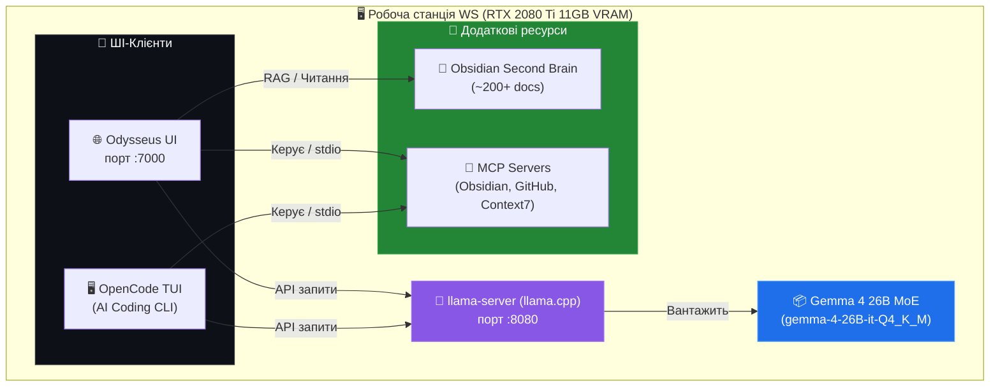

# 🧠 Практичний досвід роботи з локальним ШІ: Odysseus, OpenCode та Gemma 4 | Червень 2026

Цей звіт систематизує реальний досвід розгортання, тонкого налаштування, виправлення помилок та щоденного використання локальних ШІ-інструментів розробника на робочій станції WS (`100.68.179.109`) в інфраструктурі **Weby Homelab**.

---

## 🗺️ Загальна схема локальної AI-інфраструктури

На робочій станції WS розгорнуто єдине обчислювальне ядро (інференс), до якого підключаються різні клієнти. Це дозволяє уникнути дублювання та перевитрати VRAM.



---

## 1. 🌐 Odysseus AI Workspace: Досвід та Рішення

**Odysseus** (від `pewdiepie-archdaemon`) — це преміальний веб-орієнтований AI Workspace для глибоких досліджень (Deep Research) та мультиагентної роботи.

### ⚙️ Специфікація розгортання:
* **Тип інсталяції:** Native Linux (dockerless) під керуванням `systemd` (`odysseus-ui.service`).
* **Віртуальне середовище:** Python 3.14 venv (`/root/odysseus/venv`).
* **База даних:** SQLite (`/root/odysseus/data/app.db`) для збереження конфігурацій, сесій та налаштувань.

### 🛠️ Вирішені проблеми та кастомізація:

#### 1. 🔍 Виправлення пошукового RAG-пайплайну (DuckDuckGo CAPTCHA & DDGS)
* **Проблема:** Odysseus за замовчуванням використовує HTML-парсер для DuckDuckGo (`_html_fallback`), який швидко блокується системами захисту (CAPTCHA, HTTP 400), повертаючи порожні результати. Паралельно виникав конфлікт портів, коли вбудований `SEARXNG_INSTANCE` намагався слухати порт `8080`, який вже був зайнятий сервером `llama-server`.
* **Рішення:**
  1. У віртуальне середовище `/root/odysseus/venv` було встановлено оновлений пакет `ddgs` (офіційна бібліотека `duckduckgo-search`), яка працює напряму з JSON API.
  2. Модифіковано код Odysseus у `services/search/providers.py` для нативного використання `from ddgs import DDGS`. Пошуковий пайплайн перезапущено через `systemctl restart odysseus-ui.service`, після чого пошук почав стабільно працювати без блокувань.
  3. Пакет `ddgs` внесено до файлу `/root/odysseus/requirements.txt`.

#### 2. 🎙️ Локальний голосовий ШІ та Kokoro TTS (CPU Fallback)
* **Проблема:** При ініціалізації синтезу мовлення (Text-to-Speech) через модель Kokoro, сервіс намагався монополізувати CUDA-ресурси GPU. При нестачі VRAM (зайнятій під модель Gemma 4 26B) сервіс падав.
* **Рішення:** Внесено патч у `/root/odysseus/services/tts/tts_service.py`, що дозволяє динамічно ініціалізувати `_KokoroPipeline` на пристрої `cpu` у разі відсутності або вичерпання CUDA-ресурсів, забезпечуючи плавну деградацію продуктивності без падіння системи.

#### 3. 🗺️ Мультимовний роутинг намірів (Action Intents)
* **Проблема:** Файл `action_intents.py` за замовчуванням містив regex-патерни виключно англійською мовою. Коли користувач робив запити українською ("Пошукай в інтернеті...") або руською ("Яка погода?"), Odysseus не міг розпізнати намір виклику інструменту і просто генерував звичайний текст відповіді.
* **Рішення:** Додано локалізовані regex-патерни для пошуку, погоди та базових системних дій у конфігурацію роутера намірів.

#### 4. 🗄️ Інтеграція з Obsidian Second Brain (RAG)
* **Конфігурація:** Лінкування бази знань здійснено шляхом внесення змін до `/root/odysseus/data/personal_docs/indexed_directories.json`.
* **Результат:** RAG-сервер Odysseus проаналізував та проіндексував каталог `/root/gemma/brain` (202 документи, з яких 201 — файли розмітки Markdown), розбивши їх на 771 пошуковий чанк у локальній базі даних ChromaDB (з автоматичним спаданням до ключового пошуку при вимкненому ChromaDB).

---

## 2. 🖥️ OpenCode AI Coding Agent: Тюнінг та Fallback

**OpenCode** — це консольний TUI ШІ-агент (аналог Claude Code), орієнтований на пряму взаємодію з кодовою базою, виконання CLI-команд та автоматизований рефакторинг.

### 🛠️ Вирішені проблеми та кастомізація:

#### 1. 📏 Виправлення скидання контекстного вікна (Gemma 4 128K)
* **Проблема:** При підключенні OpenCode до локального інференсу `gemma-4-26b-it`, контекстне вікно моделі примусово скидалося з нативних 128K до 64K через те, що в конфігурації `opencode.jsonc` параметр `api.url` для провайдера залишався порожнім.
* **Рішення:** Вручну відкориговано файл `/root/.config/opencode/opencode.jsonc` та додано жорстку прив'язку: `"api": "http://127.0.0.1:8080/v1"` на рівні провайдера. Це дозволило OpenCode коректно зчитувати ліміт у `128000` токенів.

#### 2. 🎨 Кастомізація Statusline в TUI
* **Проблема:** TUI OpenCode, побудований на базі бібліотек Ink/SolidJS, не мав вбудованої підтримки динамічного налаштування statusline під час виконання.
* **Рішення:** Клоновано репозиторій `opencode-ai/opencode` на робочу станцію, внесено зміни у вихідний код TUI-компонента statusline для відображення системних метрик (Workspace Name, Active Git Branch/Dirty State, CPU/RAM load, Local/VPN IPs, Hostname). Після цього здійснено компіляцію та локальний деплой бінарника у `/root/.opencode/bin/opencode`.

#### 3. ☁️ Гібридний режим та Cloud Fallback
* **Конфігурація:** OpenCode успішно інтегровано з хмарним API **Gemini 3.5 Flash High** через `GEMINI_API_KEY` (змінна підтягується з `.env` файлу).
* **Практика:** Вбудована консольна команда `/models` дозволяє миттєво перемикатися на хмарну модель посеред сесії, якщо локальний інференс перевантажений або вимкнений для економії енергії під час блекауту.

---

## 3. 🧠 Gemma 4 26B (MoE) & 31B (Dense) на практиці

У процесі експлуатації локальних моделей сімейства **Google Gemma 4** (релізованих під ліцензією Apache 2.0 у квітні 2026 року) було визначено найкращі параметри запуску.

### 📊 Порівняльний аналіз інференс-платформ:

1. **llama.cpp / llama-server (Золотий стандарт):**
   * **Переваги:** Підтримка **Multi-Token Prediction (MTP)**, що дає приріст швидкості генерації до +65% на Gemma 4. Гнучке керування KV-Cache та низький рівень накладних витрат RAM.
   * **Результат на WS (RTX 2080 Ti):** Модель `Gemma-4-26B-it-Q4_K_M` (MoE архітектура з 3.8B активних параметрів) видає стабільні **~20.3 tokens/second** при споживанні близько 10.7 GB VRAM.

2. **Ollama:**
   * **Переваги:** Максимальна простота, автоматичний менеджмент моделей, нативна підтримка API-повідомлень Anthropic.
   * **Недоліки:** Менший контроль над розміром KV-cache у порівнянні з нативним llama.cpp сервером, що обмежує роботу з великими контекстами на картах з 11GB VRAM.

3. **vLLM:**
   * **Переваги:** Технологія PagedAttention, висока пропускна здатність при паралельних запитах.
   * **Недоліки:** Високі вимоги до VRAM для ініціалізації KV-cache (краще підходить для карт класу RTX 3090/4090 або серверів з 24GB+ VRAM).

### 🔋 Енергетична поведінка під час блекаут-сесій (EcoFlow / Батареї)

* **Memory Bandwidth limit:** Швидкість генерації локального ШІ обмежена пропускною здатністю пам'яті (Memory-Bound). При роботі від резервного живлення критично знижувати ліміт потужності відеокарти:
  ```bash
  nvidia-smi -pl 95
  ```
  Це знизило TDP RTX 2080 Ti з 250W до 95W. Швидкість генерації впала лише на ~12% (з 20.3 до 17.8 t/s), проте енергоефективність системи зросла майже вдвічі, дозволяючи збільшити час роботи від станції EcoFlow Delta 2 (1024Wh) до **~7.5 годин**.
* **Ollama Keep-Alive Optimization:** Встановлення `OLLAMA_KEEP_ALIVE=1m` гарантує, що GPU негайно переходить у стан глибокого енергозбереження (споживання падає з 25W idle до 3W) одразу після завершення генерації.

---

## 🔌 Досвід налаштування Model Context Protocol (MCP)

Обидва клієнти (Odysseus та OpenCode) були успішно об'єднані зі спільним стеком MCP-серверів для забезпечення взаємодії з оточенням.

* **GitHub MCP (`github_server.py`):** Інтеграція через stdio. Оскільки нодовський пакет `npx @modelcontextprotocol/server-github` мав проблеми із затримками, було реалізовано легкий Python-проксі, що виконує виклики через системний `os.execv`, значно прискорюючи авторизацію та роботу з PR.
* **Obsidian MCP (`obsidian_server.py`):** Замість важкого REST API плагіна Obsidian, сервер працює напряму з локальними Markdown-файлами другого мозку за шляхом `/root/gemma/brain`, що забезпечує миттєву швидкість читання та запису.
* **Context7 MCP (`context7_server.py`):** Отримано ключ `CONTEXT7_API_KEY`, який динамічно завантажується з `.env` на WS та забезпечує доступ до актуальної документації та API-референсів популярних бібліотек під час написання коду.

---

## 📈 Висновки для репозиторію AI-HomeLab

1. **Рекомендований стек для Tier 1.5 (WS з 11GB VRAM):** Зв'язка `llama-server` (запуск Gemma 4 26B MoE Q4) + `OpenCode` (для кодування) + `Odysseus` (для досліджень та RAG) є найбільш VRAM-ефективною та стабільною конфігурацією.
2. **Пріоритет нативності:** Використання нативного аудіо та мультимодальності в Gemma 4 дозволить у майбутньому відмовитись від додаткових контейнерів Whisper/TTS, заощадивши ще до 2 GB VRAM та до 15W енергії.
