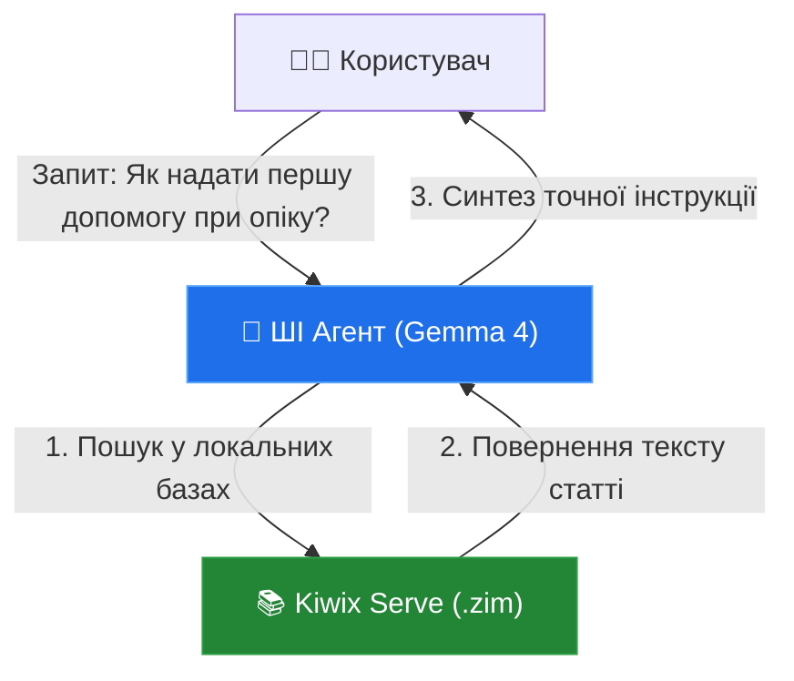

# 🔬 Порівняльний аналіз Project N.O.M.A.D. та Odysseus: Нові орієнтири для AI-HomeLab
> **Червень 2026**

Цей звіт містить глибокий аналіз двох провідних open-source проєктів локального ШІ станом на червень 2026 року — **Project N.O.M.A.D.** від Crosstalk Solutions та **Odysseus** від pewdiepie-archdaemon. На основі аналізу визначено ключові архітектурні та функціональні рішення, які доцільно інтегрувати або актуалізувати в репозиторії [weby-homelab/AI-HOMELAB](file:///root/geminicli/projects/ai/README.md).

---

## 🗺️ Ландшафт аналізованих проєктів (Червень 2026)

У середині 2026 року чітко окреслилися два взаємодоповнюючі тренди в домашніх AI-лабораторіях:
1. **Survivalist / Offline-first Edge (Project N.O.M.A.D.)** — повна автономія, виживання в умовах відсутності зв'язку, збереження накопичених людством знань локально.
2. **Comprehensive Local AI Workspace (Odysseus)** — створення повноцінної заміни комерційним хмарам (ChatGPT/Claude) з упором на мультиагентну роботу, Deep Research та взаємодію з кодом і документами.

### 📊 Порівняльна таблиця проєктів

| Характеристика | [Project N.O.M.A.D.](https://github.com/Crosstalk-Solutions/project-nomad) | [Odysseus](https://github.com/pewdiepie-archdaemon/odysseus) | [AI-HomeLab (Поточний)](file:///root/geminicli/projects/ai/README.md) |
| :--- | :--- | :--- | :--- |
| **Основна мета** | Офлайн-сервер знань, карт та базового ШІ для виживання/навчання. | Локальний мультиагентний ШІ-робочий простір (Workspace). | Навчальний хаб, оптимізація заліза, безпека та блекаут-резилієнтність в Україні. |
| **Стек інференсу** | Ollama | Ollama, сумісні API, Llama.cpp, MLX | Ollama, vLLM, Llama.cpp (LiteLLM для роутингу) |
| **Офлайн знання** | Kiwix (Wikipedia, медицина, книги), Kolibri (навчання) | Немає (орієнтований на локальні документи та онлайн-пошук) | Обмежено (базовий RAG по локальних файлах) |
| **Робота з картами** | ProtoMaps (OpenStreetMap offline vector maps) | Немає | Немає |
| **Пошук та дослідження** | Базовий RAG (Ollama + Qdrant) | Deep Research (пошук, збір джерел, генерація репортів із цитуванням) | Corrective RAG (LangGraph + Qdrant по локальних PDF/TXT) |
| **Клієнтський UI** | Власна панель (Command Center) + Open WebUI / Kiwix UI | Власний AI-орієнтований UI (чат, документо-орієнтований редактор) | Open WebUI, CLI-інструменти (Claude Code style CLI) |
| **Додаткові інструменти** | CyberChef, FlatNotes | Моніторинг моделей (Cookbook), генерація зображень, MCP-інтеграція | Моніторинг апаратного споживання (AI Ops), Langfuse трейсинг |

---

## 1. Аналіз Project N.O.M.A.D. (Offline-first Survival Server)

**Project N.O.M.A.D.** (Node for Offline Media, Archives, and Data) побудований як Docker-стек для x86 заліза. Його філософія — надати користувачу доступ до знань людства навіть у випадку глобального відключення Інтернету.

### Ключові технологічні рішення:
* **Kiwix (Offline Archives):** Використовує стиснуті `.zim` файли (бази Wikipedia, StackExchange, Wikihow, медичні енциклопедії).
* **Kolibri:** Платформа для локального навчання без інтернету (відеоуроки, вправи, курси Khan Academy).
* **ProtoMaps:** Векторні карти OpenStreetMap, які рендеряться на клієнті та займають мінімум місця (вся Україна у високій деталізації займає лічені гігабайти).
* **CyberChef / FlatNotes:** Офлайн-утиліти для маніпуляції даними та легкого ведення нотаток у Markdown.
* **Централізований Docker Compose:** Запуск усього стеку однією командою з єдиним проксі-сервером (Nginx) та простою стартовою сторінкою-порталом.

---

## 2. Аналіз Odysseus (Advanced AI Workspace)

**Odysseus** — це сучасна альтернатива комерційним AI-середовищам. Проєкт фокусується на взаємодії користувача та ШІ-агентів, надаючи преміальний UX для складних завдань.

### Ключові технологічні рішення:
* **Local Deep Research:** Агентний цикл, який приймає запит користувача, розбиває його на підзапити, шукає інформацію через локальний SearXNG / DuckDuckGo, переходить за посиланнями, витягує текст, очищає його та формує структурований звіт з посиланнями на першоджерела.
* **Порівняння моделей (Compare Mode):** Можливість надіслати один промпт у декілька локальних моделей (наприклад, Llama-3.1-8B, Gemma-4-12B, Phi-4) та отримати відповіді пліч-о-пліч.
* **Документо-орієнтований редактор (AI Workspace):** Аналог Claude Artifacts, де користувач може бачити та спільно з ШІ редагувати документи, код чи створювати презентації на розділеному екрані.
* **Розклад роботи агентів (Scheduled Briefings):** Агенти можуть виконувати фонові завдання (наприклад, моніторинг локальних логів або збір новин) та готувати ранковий/вечірній дайджест.
* **Модельний менеджер (Model Cookbook):** Веб-інтерфейс для керування локальними моделями: завантаження GGUF файлів, моніторинг пам'яті, керування контекстом (KV Cache).
* **MCP (Model Context Protocol):** Глибока інтеграція з серверами MCP для швидкого підключення ШІ до локальної файлової системи, баз даних SQLite та CLI-інструментів розробника.

---

## 🚀 Що найкращого додати та актуалізувати в AI-HomeLab?

Для посилення репозиторію [weby-homelab/AI-HOMELAB](file:///root/geminicli/projects/ai/README.md) пропонуються 5 конкретних напрямків розвитку, натхненних аналізованими проєктами.

### 1. Інтеграція Offline Knowledge (з N.O.M.A.D.) у RAG-пайплайн
**Ідея:** Додати Docker-compose конфігурацію для локального Kiwix-сервера знань та створити шаблон агента, який вміє здійснювати пошук по локальних базах Wikipedia та медичних довідниках через Kiwix API.

> [!NOTE]
> Під час блекауту RAG по власних документах корисний, але ШІ не знає загальних фактів. Доступ до локального Kiwix API дозволить моделям класу `Gemma 4 E4B` або `Phi-4 14B` отримувати точні фактичні дані з Wikipedia повністю офлайн.

* **Що додати:**
  * Docker-compose конфіг для Kiwix-serve (`configs/offline-knowledge/`).
  * Python-скрипт або LangGraph-вузол (`templates/offline_wikipedia_rag.py`) для пошуку у `.zim` файлах через API.

### 2. Шаблон Local "Deep Research" Агента (з Odysseus)
**Ідея:** Створити готовий шаблон автономного дослідницького агента на LangGraph або PydanticAI, який використовує локальні моделі (Phi-4, Gemma 4 12B) та здійснює ітеративний пошук в інтернеті.

* **Стек:** LangGraph + DuckDuckGo Lite / SearXNG + Beautiful Soup (для парсингу сторінок).
* **Що додати:**
  * Шаблон у `templates/local_deep_research_agent.py`.
  * Інструкцію з розгортання локального пошуковика SearXNG у Docker Compose.

### 3. Режим порівняння моделей (Compare Mode) через LiteLLM + Open WebUI
**Ідея:** Оскільки AI-HomeLab вже використовує LiteLLM, Compare Mode можна легко реалізувати на рівні Open WebUI. Потрібно додати детальну інструкцію та налаштування для одночасного тестування моделей.

* **Що зробити:**
  * Оновити `docs/setup/ai-ops.md` або створити окремий гайд з налаштування спліт-чату (Split Chat) в Open WebUI для порівняння швидкості (`t/s`), енергоспоживання (`W`) та якості генерації різних SLM-моделей пліч-о-пліч.

### 4. Практичний MCP-стек (Model Context Protocol)
**Ідея:** Перетворити теоретичну згадку про MCP на практичні шаблони. Надати готові конфігурації локальних MCP-серверів для взаємодії з хостом.

* **Що додати:**
  * Docker-compose конфіг (`configs/mcp-stack/`) з популярними безпечними MCP-серверами: `filesystem` (доступ до виділеної папки), `sqlite` (робота з локальною БД), `fetch` (безпечне скачування веб-сторінок).
  * Гайд з підключення цих серверів до Open WebUI та Claude Desktop.

### 5. Об'єднаний AI-HomeLab Dashboard (Портал)
**Ідея:** Створити стартову сторінку (за прикладом Command Center у N.O.M.A.D.), яка об'єднує посилання на всі локальні сервіси лаби.

* **Стек:** Простий, легкий та стильний HTML/CSS dashboard (наприклад, на базі Homepage або Flame) у Docker.
* **Що додати:**
  * `configs/dashboard/docker-compose.yml` з конфігурацією сервісу моніторингу та посиланнями на:
    * Open WebUI (порт 3000)
    * LiteLLM Admin (порт 4000)
    * Netdata / Prometheus (моніторинг заліза)
    * Kiwix (офлайн енциклопедії)
    * n8n (автоматизація)

---

## 🛠️ План оновлення ROADMAP.md

Для реалізації цих покращень пропонується внести зміни до [ROADMAP.md](file:///root/geminicli/projects/ai/ROADMAP.md), доповнивши **Фазу 2 (Практика)** та **Фазу 3 (Спільнота)** новими пунктами:

### Фаза 2 — Практика (Додати):
* [ ] Локальний Deep Research агент на LangGraph/PydanticAI (інтеграція SearXNG/DuckDuckGo)
* [ ] Docker-compose стек для офлайн-бази знань (Kiwix + Wikipedia) та RAG-конектор
* [ ] Практичний посібник та compose-конфіги для інтеграції локальних MCP-серверів (Filesystem, SQLite, Fetch)

### Фаза 3 — Спільнота (Додати):
* [ ] Стартовий AI-HomeLab Dashboard для об'єднання локальних сервісів (інференс, моніторинг, бази знань)
* [ ] Інструкція з налаштування Compare Mode (спліт-тестування моделей) в Open WebUI

---

## 🔬 Результати глибокого аналізу та тестування на WS (Червень 2026)

У червні 2026 року було проведено глибокий аналіз та тестування інсталяції Odysseus, розгорнутої на робочій станції WS (`100.68.179.109:7000`).

### 1. Архітектура та процеси
Інсталяція Odysseus на WS є класичною (bare-metal/dockerless) і працює під керуванням `systemd`:
* **Odysseus UI & API:** Працює як сервіс `odysseus-ui.service` на порту `7000` (uvicorn) з віртуального середовища `/root/odysseus/venv`. Також керує чотирма вбудованими MCP-серверами: `image_gen_server.py`, `memory_server.py`, `rag_server.py`, `email_server.py`.
* **Обчислювальне ядро (Inference):** Працює як сервіс `llama-server.service` (llama.cpp) на порту `8080`, обслуговуючи модель `gemma-4-26B-A4B-it-UD-Q4_K_M.gguf` з VRAM RTX 2080 Ti (~10.7 GB VRAM). Швидкість генерації становить ~20.3 tokens/second.

### 2. Конфігурація бази даних та записів (app.db)
База даних SQLite розташована за шляхом `/root/odysseus/data/app.db`. Аналіз таблиць показав:
* **Ендпоінти (`model_endpoints`):** Налаштовано 1 локальний ендпоінт `http://100.68.179.109:8080/v1` з підключеною моделлю `gemma-4-26B-A4B-it-UD-Q4_K_M.gguf`.
* **Активні сесії:** У таблиці `sessions` виявлено 3 сесії: `Assistant` (дефолтна), `gemma-4-26B...` (тестова) та `Antigravity CLI Statusline Search` (створена 16.06.2026).
* **Користувачі та сесії:** Авторизація реалізована через хешування паролів у `data/auth.json` (користувач `admin`). Активні сесії зберігаються у `data/sessions.json` (виявлено активну сесію користувача з хоста `yoga` `100.90.124.16`).

### 3. Тестування пошукового RAG-пайплайну (Помилка SearXNG & Fallback)
Під час тестування виявлено критичну особливість конфігурації пошуку:
1. **Конфлікт портів:** У конфігурації `.env` параметр `SEARXNG_INSTANCE` вказує на `http://localhost:8080`. Проте порт `8080` зайнятий сервером `llama-server`. Запити до SearXNG завершуються помилкою `404 Not Found`.
2. **Робота Fallback-ланцюжка:** Було протестовано відправку запиту із прапорцем `"use_web": true` через API. Система успішно обробила помилку SearXNG, розпізнала відсутність пакету `duckduckgo-search` і переключилася на вбудований HTML-парсер DuckDuckGo (`_html_fallback`):
   * Пошуковий запит: *"Пошукай в інтернеті про Antigravity cli"*
   * Результати пошуку: Отримано 5 посилань від DuckDuckGo.
   * Вилучення контенту (Web Scraping): Успішно завантажено та очищено текстовий вміст з 2-х джерел (developers.google.com та github.com).
   * Інтеграція в контекст: Текст сторінок додано у промпт як `web search results` (~4700 токенів).
   * Генерація відповіді: Модель Gemma 4 26B сформувала вичерпний структурований звіт про Antigravity CLI на основі знайдених в інтернеті свіжих матеріалів.

> [!TIP]
> **Рекомендація з оптимізації:** Для усунення помилок у логах `odysseus-ui` слід змінити порт `llama-server` (наприклад, на `8081` або `8090`) або перенести SearXNG на інший порт, щоб уникнути конфликту на `8080`.
