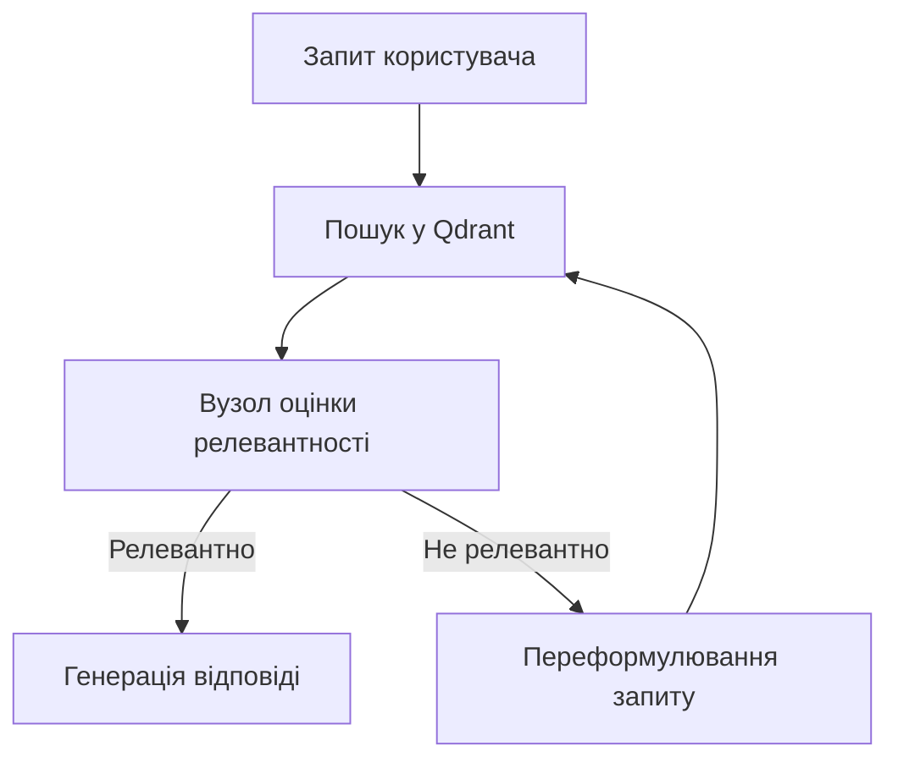

# 🧠 Шаблони та приклади коду (AI-HomeLab Templates Guide)

> **Мета:** Надати готові, автономні та безпечні шаблони для швидкого старту розробки власних локальних ШІ-агентів, інтеграції довготривалої пам'яті та побудови RAG-пайплайнів.

---

## 📑 Зміст

1. [Філософія шаблонів (Templates Philosophy)](#-філософія-шаблонів-templates-philosophy)
2. [Шаблон CLI-агента (Claude Code Style CLI)](#-1-шаблон-cli-агента-claude-code-style-cli)
3. [Шаблон циклічного RAG-агента (Corrective RAG)](#-2-шаблон-циклічного-rag-агента-corrective-rag)
4. [Шаблон довготривалої пам'яті (Agent Persistent Memory)](#-3-шаблон-довготривалої-памяті-agent-persistent-memory)
5. [Швидке розгортання залежностей (Requirements Quickstart)](#-швидке-розгортання-залежностей-requirements-quickstart)

---

## 🌐 Філософія шаблонів (Templates Philosophy)

Усі шаблони в репозиторії **AI-HomeLab** спроєктовані відповідно до трьох ключових принципів:
1. **Локальність перш за все (Local-First):** Жоден промпт або документ не повинен витікати на сторонні сервери. Усі обчислення виконуються на домашньому обладнанні (через Ollama, Qdrant тощо).
2. **Контроль та безпека (Human-in-the-Loop):** Агенти виконують модифікацію файлів та термінальні команди виключно після явного підтвердження користувачем.
3. **Типізація та надійність:** Використання сучасних стандартів (Pydantic v2, типізовані схеми) для захисту від неочікуваних збоїв (fail-closed).

---

## 🤖 1. Шаблон CLI-агента (Claude Code Style CLI)

Шаблон знаходиться в директорії [`templates/agent-code-cli/`](../templates/agent-code-cli/). Це консольний ШІ-помічник для парного програмування, що працює з вашими локальними файлами.

### Особливості архітектури:
* **Безпечна зона (CWD Scope Check):** Агент не може зчитувати чи перезаписувати файли за межами робочої директорії проєкту.
* **Аналіз деструктивних команд:** Спроби запустити команди на кшталт `rm -rf /` або змінити системні файли блокуються вбудованим парсером безпеки.
* **Резервне копіювання (Rollback History):** Перед кожним редагуванням файлу оригінал автоматично зберігається в `.agent/history/` з міткою часу для можливості миттєвого відкату.
* **Інтерактивний Diff-перегляд:** Зміни у файлах відображаються у зручному Git-style форматі (додані рядки зеленим, видалені — червоним) перед отриманням згоди користувача на запис.
* **Локальний провайдер Ollama:** Робота з моделями Gemma 4 та LLaMA 4 через нативний API без використання важких сторонніх хмарних бібліотек.

### Стек технологій:
* **Мова:** Python 3.10+
* **Інтерфейс:** Click, Prompt Toolkit, Rich
* **Інференс:** Ollama Client (локально) / Claude Anthropic API (опціонально в хмарі)

### Запуск та використання:
1. Перейдіть до папки шаблону:
   ```bash
   cd templates/agent-code-cli
   ```
2. Встановіть пакет у режимі розробки:
   ```bash
   pip install -e .
   ```
3. Запустіть агента (за замовчуванням використовує модель `gemma3:4b` або `gemma4:2b` через Ollama):
   ```bash
   agy
   ```

---

## 🧠 2. Шаблон циклічного RAG-агента (Corrective RAG)

Сценарій реалізовано у файлі [`templates/langgraph_rag_agent.py`](../templates/langgraph_rag_agent.py). Це повноцінний автономний RAG-агент, що використовує циклічну логіку для підвищення точності відповідей.

### Особливості архітектури:
 відрізняється від класичного RAG тим, що впроваджує етап оцінки (Evaluator Node):
1. **Пошук (Retrieve):** Агент дістає релевантні фрагменти документів із векторної бази даних Qdrant.
2. **Оцінка (Grade):** ШІ-модель аналізує кожен фрагмент і визначає його реальну релевантність запиту.
3. **Дія (Action Decision):**
   * Якщо інформації достатньо -> Генерується фінальна відповідь.
   * Якщо інформація нерелевантна -> Запускається вузол **Переформулювання запиту (Rewrite)**, запит оптимізується, і цикл пошуку повторюється.



### Стек технологій:
* **Мова:** Python 3.11+
* **Фреймворки:** LangGraph (керування станом графа), LangChain (інтеграції)
* **Векторна база:** Qdrant (запуск у Docker-контейнері)
* **Інференс:** Ollama (`gemma3:4b` та `nomic-embed-text` для векторних представлень)

### Запуск та використання:
1. Запустіть локальний векторний сервер Qdrant:
   ```bash
   docker run -d -p 6333:6333 -p 6334:6334 qdrant/qdrant
   ```
2. Переконайтеся, що моделі завантажені в Ollama:
   ```bash
   ollama pull gemma3:4b
   ollama pull nomic-embed-text
   ```
3. Встановіть необхідні бібліотеки:
   ```bash
   pip install langgraph langchain-ollama langchain-qdrant qdrant-client pydantic requests
   ```
4. Запустіть скрипт для демонстрації циклу пошуку та відповідей:
   ```bash
   python templates/langgraph_rag_agent.py
   ```

---

## 💾 3. Шаблон довготривалої пам'яті (Agent Persistent Memory)

Код реалізовано у файлі [`templates/agent_persistent_memory.py`](../templates/agent_persistent_memory.py). Шаблон вирішує проблему короткочасної пам'яті контекстного вікна моделей, надаючи агенту змогу зберігати важливі факти про користувача та проєкт.

### Особливості архітектури:
* **Гібридний пошук (Hybrid Memory Retrieval):**
   * **Семантичний пошук (Semantic search):** Знаходження фактів за змістом через векторні ембедінги Ollama (`nomic-embed-text`).
   * **Резервний пошук (Keyword search):** Якщо сервіс Ollama тимчасово недоступний (наприклад, під час відключення світла при роботі на резервному живленні), система автоматично перемикається на повнотекстовий пошук SQLite FTS5.
* **Автоматична дедуплікація (Upsert):** Система самостійно оновлює наявні факти, якщо надходить новіша інформація про той самий об'єкт, запобігаючи дублюванню та засміченню пам'яті.
* **Type-Safe Schema:** Валідація об'єктів спогадів за допомогою Pydantic v2.

### Стек технологій:
* **Мова:** Python 3.10+
* **База даних:** SQLite (вбудована в Python, не потребує встановлення серверів)
* **Валідація:** Pydantic v2
* **Зв'язок:** Requests (для звернень до API Ollama)

### Запуск та використання:
1. Переконайтеся, що Ollama запущена та завантажена модель `nomic-embed-text`.
2. Запустіть інтерактивний демонстраційний скрипт, який створить локальну базу даних `agent_memory.db`, збереже кілька фактів та виконає семантичний пошук:
   ```bash
   python templates/agent_persistent_memory.py
   ```

---

## ⚡ Швидке розгортання залежностей (Requirements Quickstart)

Для зручності запуску всіх шаблонів "з коробки" ви можете встановити спільне віртуальне оточення:

```bash
# Створення та активація віртуального оточення
python3 -m venv .venv
source .venv/bin/activate

# Встановлення спільних залежностей
pip install pydantic requests click prompt_toolkit rich langgraph langchain-ollama langchain-qdrant qdrant-client
```
