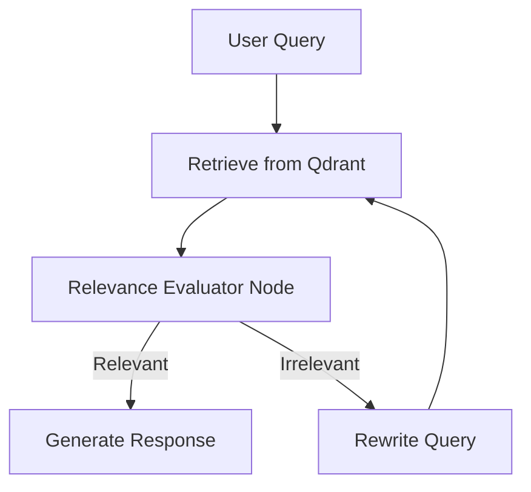

# 🧠 Code Templates and Examples (AI-HomeLab Templates Guide)

> **Goal:** Provide ready-to-use, autonomous, and secure templates to jumpstart local AI agent development, long-term memory integration, and RAG pipeline construction.

---

## 📑 Table of Contents

1. [Templates Philosophy](#-templates-philosophy)
2. [CLI Agent Template (Claude Code Style CLI)](#-1-cli-agent-template-claude-code-style-cli)
3. [Cyclic RAG Agent Template (Corrective RAG)](#-2-cyclic-rag-agent-template-corrective-rag)
4. [Long-Term Memory Template (Agent Persistent Memory)](#-3-long-term-memory-template-agent-persistent-memory)
5. [Requirements Quickstart](#-requirements-quickstart)

---

## 🌐 Templates Philosophy

All templates in the **AI-HomeLab** repository are designed based on three core principles:
1. **Local-First Default:** No prompts or sensitive files should leak to third-party servers. All processing runs locally on your home hardware (via Ollama, Qdrant, SQLite).
2. **Human-in-the-Loop Control:** Agents perform file editing and terminal command execution only after explicit user confirmation.
3. **Type Safety and Resiliency:** Built using modern type-safe validation structures (Pydantic v2) to ensure a "fail-closed" mechanism in case of unexpected errors.

---

## 🤖 1. CLI Agent Template (Claude Code Style CLI)

Located in the [`templates/agent-code-cli/`](../templates/agent-code-cli/) directory. This is a console-based AI programming assistant for pair programming on your local codebase.

### Architectural Features:
* **Safe Zone (CWD Scope Check):** The agent is strictly prevented from reading or writing files outside the project's root working directory.
* **Destructive Command Analyzer:** Attempts to run commands like `rm -rf /` or modify system configurations are automatically intercepted and blocked.
* **Rollback History (Pre-edit Backups):** Before writing any changes to a file, the original content is backed up in `.agent/history/` with a timestamp for instant recovery.
* **Interactive Diff Viewer:** Modifications are printed in a clean Git-style format (added lines in green, deleted in red) for review before writing.
* **Native Ollama Integration:** Communicates directly with Gemma 4 or LLaMA 4 using the native Ollama API, avoiding heavy cloud wrappers.

### Tech Stack:
* **Language:** Python 3.10+
* **Interface:** Click, Prompt Toolkit, Rich
* **Inference:** Ollama Client (Local) / Claude Anthropic API (Optional cloud fallback)

### Getting Started:
1. Navigate to the template directory:
   ```bash
   cd templates/agent-code-cli
   ```
2. Install the package in editable mode:
   ```bash
   pip install -e .
   ```
3. Run the agent (defaults to `gemma3:4b` or `gemma4:2b` via Ollama):
   ```bash
   agy
   ```

---

## 🧠 2. Cyclic RAG Agent Template (Corrective RAG)

Implemented in [`templates/langgraph_rag_agent.py`](../templates/langgraph_rag_agent.py). This is a fully autonomous RAG agent that implements a cyclic retrieval logic to maximize response accuracy.

### Architectural Features:
Corrective RAG (CRAG) extends standard RAG pipelines by introducing an Evaluator Node:
1. **Retrieve:** Queries the local Qdrant vector database for relevant document chunks.
2. **Grade:** An LLM evaluates each chunk and determines if it is truly relevant to the query.
3. **Action Decision:**
   * If sufficient info is found -> Generate the final response.
   * If info is missing or irrelevant -> Trigger the **Rewrite Node** to optimize the search query and re-run retrieval.



### Tech Stack:
* **Language:** Python 3.11+
* **Frameworks:** LangGraph (state graph management), LangChain (integrations)
* **Vector DB:** Qdrant (deployed via Docker)
* **Inference:** Ollama (`gemma3:4b` and `nomic-embed-text` for embeddings)

### Getting Started:
1. Start the local Qdrant vector database container:
   ```bash
   docker run -d -p 6333:6333 -p 6334:6334 qdrant/qdrant
   ```
2. Pull the required models in Ollama:
   ```bash
   ollama pull gemma3:4b
   ollama pull nomic-embed-text
   ```
3. Install dependencies:
   ```bash
   pip install langgraph langchain-ollama langchain-qdrant qdrant-client pydantic requests
   ```
4. Run the demo script to observe the cyclic search and response generation:
   ```bash
   python templates/langgraph_rag_agent.py
   ```

---

## 💾 3. Long-Term Memory Template (Agent Persistent Memory)

Implemented in [`templates/agent_persistent_memory.py`](../templates/agent_persistent_memory.py). This template addresses the short-term context window limitation by allowing agents to persist facts and user preferences across runs.

### Architectural Features:
* **Hybrid Memory Retrieval:**
   * **Semantic Search:** Finds memories by meaning using Ollama embeddings (`nomic-embed-text`).
   * **Keyword Fallback:** If Ollama is offline (e.g. running on low backup power during a blackout), the system falls back to SQLite FTS5 full-text keyword matching.
* **Automatic De-duplication (Upsert):** The engine updates existing facts when newer information about the same topic is supplied, preventing memory clutter.
* **Type-Safe Schema:** Validates memory payloads via Pydantic v2.

### Tech Stack:
* **Language:** Python 3.10+
* **Database:** SQLite (built-in, serverless)
* **Validation:** Pydantic v2
* **Connection:** Requests (for querying local Ollama endpoint)

### Getting Started:
1. Ensure Ollama is running and the `nomic-embed-text` model is pulled.
2. Run the interactive demonstration script, which initializes `agent_memory.db`, registers sample facts, and performs semantic lookup:
   ```bash
   python templates/agent_persistent_memory.py
   ```

---

## ⚡ Requirements Quickstart

To install all template dependencies in a single virtual environment:

```bash
# Create and activate a virtual environment
python3 -m venv .venv
source .venv/bin/activate

# Install shared requirements
pip install pydantic requests click prompt_toolkit rich langgraph langchain-ollama langchain-qdrant qdrant-client
```
